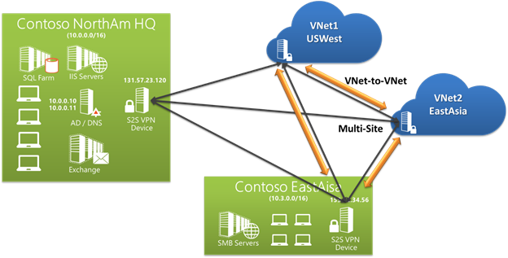

<properties
    pageTitle="Criar imagens em redução"
    description="Explica como criar imagens em redução de acordo com as diretrizes definidas para os repositórios Azure."
    services=""
    solutions=""
    documentationCenter=""
    authors="kenhoff"
    manager="ilanas"
    editor="tysonn"/>

<tags
    ms.service="contributor-guide"
    ms.devlang=""
    ms.topic="article"
    ms.tgt_pltfrm=""
    ms.workload=""
    ms.date="06/25/2015"
    ms.author="kenhoff" />

# <a name="create-images-in-markdown"></a>Criar imagens em redução

## <a name="image-folder-creation-and-link-syntax"></a>Sintaxe de criação e link de pasta de imagem

Para um novo artigo, você precisará criar uma pasta no seguinte local:

    /articles/<service-directory>/media/<article-name>/

Por exemplo:

    /articles/app-service/media/app-service-enterprise-multichannel-apps/

Depois de criar a pasta e imagens adicionadas a ela, use a seguinte sintaxe para criar imagens em seu artigo:

```

```
Exemplo:

Consulte [o modelo de redução](../markdown%20templates/markdown-template-for-new-articles.md) para obter um exemplo.  Os links de referência de imagem neste modelo redução foram projetados para serem na parte inferior do modelo.

## <a name="guidelines-specific-to-azuremicrosoftcom"></a>Diretrizes específicas para azure.microsoft.com

Capturas de tela atualmente recomenda-se não for possível incluir etapas de reprodução. Escreva o seu conteúdo para que o conteúdo pode espera sem as capturas de tela, se necessário.

Use as seguintes diretrizes ao criar e incluir arquivos art:
- Não compartilhe arquivos art em documentos. Copie o arquivo que você precisa e adicioná-lo para a pasta de mídia para o tópico específico. Compartilhamento entre arquivos não é recomendado porque é mais fácil para remover obsoleta conteúdo e imagens que mantém o repo limpa.

- Formatos de arquivo: usar os arquivos. PNG - são qualidade superior e manter sua qualidade durante o processo de localização. Outros formatos de arquivo não mantêm sua qualidade também. O formato JPEG é permitido, mas não preferencial.  Não há arquivos GIF animados.

- Use quadrados vermelhos da largura padrão fornecido no Paint (5 px) para chamar a atenção para elementos específicos em capturas de tela.  

    Exemplo:

    

- Quando faz sentido, fique à vontade para cortar imagens, portanto os elementos de interface do usuário serão exibidos no tamanho máximo. Certifique-se de que o contexto é claro para os usuários, apesar.

- Evite espaço em branco nas bordas do capturas de tela. Se você cortar uma captura de tela de uma forma que deixa o plano de fundo branco nas bordas, adicione uma borda de pixel único cinza ao redor da imagem.  Se usando Paint, use o cinza claro da pallete de cor do padrão (0xC3C3C3). Se usando algum outro aplicativo gráfico, a cor RGB é R195, G195, 195. Você pode adicionar facilmente uma borda cinza ao redor de uma imagem no Visio, para fazer isso, selecione a imagem, selecione a linha e garantir que o a cor correta está definida e, em seguida, altere a espessura da linha para 1 1/2 pt.  Capturas de tela devem ter uma borda cinza 1 pixels de largura para que as áreas brancas a captura de tela não desfoque na página da web.

    Exemplo:

    
    
    Para uma ferramenta ajudar a automatizar o processo de adicionar a borda necessária para imagens, consulte a [ferramenta de AddACOMBorder - como automatizar o processo de adicionar a borda necessários 1 pixel cinza imagens ACOM](https://github.com/Azure/Azure-CSI-Content-Tools/tree/master/Tools/AddACOMImageBorder).

- Imagens conceituais com espaço em branco não é necessário uma borda cinza.  

    Exemplo:

    

- Não tente criar uma imagem muito grande.  Imagens serão redimensionadas automaticamente se elas forem muito grandes. No entanto, o redimensionamento, às vezes, faz com que o grau de seleção, portanto, é recomendável que você limite a largura das imagens para 780 px e manualmente redimensionar imagens antes do envio, se necessário.

- Mostrar saídas de comando em capturas de tela.  Se seu artigo inclui etapas onde o usuário está trabalhando em um shell, é útil mostrar a saída do comando em capturas de tela. Nesse caso, restringir sua largura de shell para aproximadamente 72 caracteres geralmente garante que sua imagem permanecerá dentro a orientação de largura px 780. Antes de fazer uma captura de tela de saída, redimensione a janela para que apenas o comando relevante e saída seja mostrado (opcionalmente com uma linha em branco em ambos os lados).

- Leve as capturas de tela inteiras do windows quando possível. Ao tirar uma captura de tela da janela do navegador, redimensione a janela do navegador para 780 px larga ou menos e manter a altura da janela do navegador como breve possível, de modo que seu aplicativo se ajuste dentro da janela.

    Exemplo:

    

- Tenha cuidado com quais informações são exibidas em capturas de tela.  Não revele informações pessoais ou informações internas da empresa.

- Arte conceitual ou diagramas, use os ícones oficiais do conjunto de símbolo e ícone de nuvem e Enterprise. Um conjunto público está disponível em http://aka.ms/CnESymbols.

- Substitua informações pessoais ou particulares em capturas de tela com texto de espaço reservado entre colchetes ângulo. Isso inclui nomes de usuário, IDs de assinatura e outras informações relacionadas. Nomes de pessoais podem ser substituídos por um [aprovado nome fictious](https://aka.ms/ficticiousnames)(link somente funcionário). Não use a dica de lápis ou marcador no Paint ocultem ou Desfoque informações particulares ou pessoais.

  A imagem a seguir foi atualizada corretamente para substituir a real **ID da assinatura** com as informações de espaço reservado:

  

### <a name="contributors-guide-links"></a>Links de guia dos colaboradores

- [Artigo de visão geral](./../README.md)
- [Índice de artigos de orientação](./contributor-guide-index.md)
