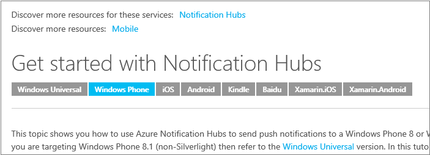

<properties
    title="required"
    pageTitle="Extensões de redução personalizados usadas em nossos artigos técnicos"
    description="Lista as extensões de redução personalizados que permitem vídeos incorporados, anotações e dicas, conteúdo reutilizável e outro item artigos técnicos azure.microsoft.com."
    services=""
    solutions=""
    documentationCenter=""
    authors="tysonn"
    manager="carolz"
    editor=""/>

<tags
    ms.service="contributor-guide"
    ms.devlang=""
    ms.topic="article"
    ms.tgt_pltfrm=""
    ms.workload=""
    ms.date="01/22/2015"
    ms.author="tysonn"/>

## Redução de Azure.microsoft.com

Para obter dicas gerais redução, consulte [Noções básicas de redução](https://help.github.com/articles/markdown-basics/) e nossa [redução cheatsheet](./media/documents/markdown-cheatsheet.pdf?raw=true). Se você precisar criar referências cruzadas do artigo em redução, consulte o [guia vinculação] (. / create-links-markdown.md#markdown-syntax-for-acom-relative-links.md/).

Azure.microsoft.com suporta [isolados blocos de código](https://help.github.com/articles/github-flavored-markdown/#fenced-code-blocks) e [Realce de sintaxe](https://help.github.com/articles/github-flavored-markdown/#syntax-highlighting). Entretanto, ACOM suporta apenas uma sintaxe realce esquema de cores, independentemente do idioma que você especificar em um bloco de código.

## Extensões de redução personalizados usadas em nossos artigos técnicos

Nossos artigos usam GitHub flavored redução para a maioria dos artigo formatação - parágrafos, links, listas, títulos, etc. Mas podemos usar extensões de redução personalizado onde precisamos formatação sofisticados nas páginas renderizadas azure.microsoft.com. Veja aqui as extensões que estamos atualmente usando:

+ [Observações e dicas]
+ [Inclui]
+ [Vídeos incorporados]
+ [Seletores de plataforma e da tecnologia]

## Observações e dicas

Você pode escolher 4 tipos de observações e dicas:

- AZURE. OBSERVAÇÃO
- AZURE. AVISO
- AZURE. TIPss
- AZURE. IMPORTANTE

###Uso
Em geral, use notas e dicas moderadamente em toda sua artigos. Quando você usá-los, escolha o tipo apropriado de anotação ou dica:

- Use o AZURE. Observação para realçar informações neutras ou positivas que enfatizam ou complementam pontos importantes do texto principal. Uma anotação fornece informações que se aplicam apenas em casos especiais.

  

- Use o AZURE. Aviso para alertar o usuário a uma condição que pode causar um problema no futuro. Por exemplo, selecionando uma opção de certas ou escolha de um determinado talvez permanentemente bloquear você em um cenário específico.

  

- Use o AZURE. Dica para ajudar os usuários a aplicar as técnicas e procedimentos descritos no texto às suas necessidades específicas. Uma dica também pode sugerir métodos alternativos que podem não ser óbvios. Dicas, no entanto, não são essenciais para a Noções básicas sobre o texto.

  

- Use o AZURE. IMPORTANTE para fornecer informações essenciais para a conclusão de uma tarefa.

  

Enquanto essas anotações e dicas suportam links, imagens, listas e blocos de código, tente manter suas anotações e dicas simples e direto. Se você perceber que está criando anotações complexas com muitos formatação, que podem ser um sinal de que você precisa apenas de outra seção no texto principal do artigo. E, muitas anotações em um artigo podem ser confusos e difícil de digitalizar ou ler.

###Redução de amostra

As amostras todos mostram um AZURE. OBSERVAÇÃO. Para usar uma dica, aviso ou importante, substitua "Observação" na redução:

    > [AZURE.TIP]

    > [AZURE.WARNING]

    > [AZURE.IMPORTANT]

Único parágrafo:

    > [AZURE.NOTE] Para concluir este tutorial, você deve ter uma conta do Microsoft Azure active. Se você não tiver uma conta, você pode criar uma conta de avaliação gratuita em apenas alguns minutos.

Multiparagraph:

    > [AZURE.NOTE] Para concluir este tutorial, você deve ter uma conta do Microsoft Azure active.
    >
    > Se você não tiver uma conta, você pode [criar uma conta de avaliação gratuita](http://www.windowsazure.com/pricing/free-trial/) em apenas alguns minutos.

## Inclui

Texto reutilizável em nosso repositório GitHub reside em arquivos que chamamos "inclui". Quando você tiver texto que precisa ser usado em vários artigos, você incluir uma referência a esse arquivo de informações reutilizáveis. A incluir em si é um arquivo simples redução (.md). Ele pode conter qualquer redução válida, incluindo texto, links e imagens. Todos incluem redução arquivos devem estar no [o / inclui diretório](https://github.com/Azure/azure-content/tree/master/includes) na raiz do repositório. Quando o artigo for publicado, o texto de incluir é integrado perfeitamente o tópico publicado.

- Podemos usar uma sintaxe específica para referenciar um inclusão.

- Arquivos de mídia que você coloca em um inclusão devem ser criados em uma pasta de mídia específicos para incluir. Pastas de mídia para inclui pertence na [pasta azure conteúdo/inclui/mídia](https://github.com/Azure/azure-content/tree/master/includes/media). Diretório de mídia não deve conter qualquer imagens em suas raiz. Se a incluir não tiver imagens, não é necessário um diretório de mídia correspondente.

###Uso

- Use inclui onde precisar o mesmo texto apareça em vários artigos.

- Inclui destinam-se a ser usado para quantidades significativas de conteúdo - um parágrafo ou dois, um procedimento compartilhado ou uma seção compartilhada. Não usá-las para qualquer coisa menor do que uma frase; **eles são não para nomes de produtos**.

- Garantir que todo o texto em um inclusão escrito em orações completas ou frases que não dependem de texto anterior ou seguinte o artigo que faz referência a incluir. Ignorando neste guia cria uma cadeia de caracteres untranslatable no artigo que divide a experiência localizada. 

- Não incorporar inclui dentro dos outros inclui. Eles não são suportados pelo DPS sistema de publicação.

- Não compartilhe mídia entre arquivos. Use um arquivo separado com um nome exclusivo para cada incluir e o artigo. Armazene o arquivo de mídia na pasta de mídia associada a incluir.

- Não use um inclusão como somente o conteúdo de um artigo.  Inclui devem ser complementares ao conteúdo o restante do artigo.

- Porque todos inclui deve estar no / inclui diretório, o caminho para um inclusão de um artigo é sempre

    .. / inclui

- NÃO repetir uma referência de filename link ou imagem no artigo e incluir. Adicionar "-incluir" ao link mídia ou referência de nome de arquivo para evitar a referência de repetição:

 **Referência de link**

 Alteração: odata.org para: incluir odata.org

 **Referência de imagem**

 Alteração: table.png para: include.png de tabela

###Redução de amostra
A sintaxe para adicionar um inclusão para um artigo da documentação é:

    [AZURE.INCLUDE [include-short-name](../includes/include-file-name.md)]

Exemplo

    [AZURE.INCLUDE [howto-blob-storage](../includes/howto-blob-storage.md)]

A primeira parte de inclusão é o nome de incluir sem o caminho e a extensão de .md. A segunda parte é o caminho relativo para a incluir nos / inclui diretório, com a extensão .md.

###Processamento

Na página GitHub processada, a incluir serão renderizados da seguinte maneira:

 [AZURE. INCLUIR como armazenamento de blob]

No HTML renderizado em azure.microsoft.com, o HTML a inclui mesclados para o restante das HTML do documento. No entanto, o HTML conterá um HTML comentário com o original incluem redução filename e o hash de confirmação GitHub. Esse comentário é incluído para fins de solução de problemas para que o conteúdo de origem facilmente pode ser identificado e encontrado no GitHub:

  

## Vídeos incorporados

Nossos artigos técnicos suportam embeddeded vídeos em artigos técnicos contanto que os vídeos sejam no site de [canal 9](http://channel9.msdn.com/) da Microsoft. Os vídeos de 9 de canal devem ser integrados com [o Centro de vídeo azure.microsoft.com](http://azure.microsoft.com/documentation/videos/home/). Atualmente, não suportamos vídeos do YouTube inseridos; Se você for um colaborador de comunidade, você está bem-vindo ao vincular a YouTube se o vídeo que você deseja destacar é lançado lá. Os colaboradores Microsoft devem usar canal 9 e o Centro de vídeo.

### Uso

- Certifique-se de que o vídeo está no centro do vídeo.

- Copie a ID de vídeo da URL amigável do vídeo no canal 9 ou do Centro de vídeo do Azure. Por exemplo, a ID de vídeo para o vídeo no [http://azure.microsoft.com/documentation/videos/azure-scheduler-unusual-schedules/](http://azure.microsoft.com/documentation/videos/azure-scheduler-unusual-schedules/) é **azure Agendador-incomuns agendas**.

### Sintaxe

    > [AZURE.VIDEO video-id-string]

### Processamento

Em GitHub: [https://github.com/Azure/azure-content-pr/blob/master/articles/web-sites-backup.md](https://github.com/Azure/azure-content-pr/blob/master/articles/web-sites-backup.md)

Artigo publicado: [http://azure.microsoft.com/documentation/articles/web-sites-backup/](http://azure.microsoft.com/documentation/articles/web-sites-backup/)

## Seletores de plataforma e da tecnologia

Use switchers plataforma e da tecnologia da artigos técnicos quando você criar várias versões do mesmo artigo às diferenças de endereço de implementação entre tecnologias ou plataformas. Isso é geralmente mais se aplica à nosso conteúdo de plataforma móvel para desenvolvedores. Há dois tipos diferentes de seletores, [seletores simples](#simple-selectors) e [seletores bidirecionais](#two-way-selectors).

Como a redução de seletor mesmo passa em cada tópico na seleção, recomendamos posicionando o seletor do seu tópico em um incluir, em seguida, referenciando que incluir em todos os seus tópicos que usam o seletor de mesmo.

###Seletores simples

Seletores (unidirecionais) simples renderizados como um conjunto de botões de opção logo abaixo do título. Use esses botões quando os clientes precisam escolham um dos tópicos em um conjunto único de plataforma ou tecnologia, como .NET, node e Java.  Usar a extensão de redução personalizado para qualquer seletores - não use HTML para seletores.  

Consulte [Introdução com Hubs de notificação](http://azure.microsoft.com/documentation/articles/notification-hubs-windows-phone-get-started/) para ver como o autor criada 8 versões do mesmo artigo, mas seletores usados para habilitar a navegação todas elas.

####Sintaxe

    > [AZURE.SELECTOR]
    - [Vincular rótulo #1](link #1 url)
    - [rótulo Link #2](link #2 url)

Exemplo:

    > [AZURE.SELECTOR]
    - [Windows universal](../articles/notification-hubs-windows-store-dotnet-get-started/)
    - [Do Windows Phone](../articles/notification-hubs-windows-phone-get-started/)
    - [iOS](../articles/notification-hubs-ios-get-started/)
    - [Android](../articles/notification-hubs-android-get-started/)
    - [Kindle](../articles/notification-hubs-kindle-get-started/)
    - [Baidu](../articles/notification-hubs-baidu-get-started/)
    - [Xamarin.iOS](../articles/partner-xamarin-notification-hubs-ios-get-started/)
    - [Xamarin.Android](../articles/partner-xamarin-notification-hubs-android-get-started/)

#### Processamento

A imagem acima mostra a renderização no azure.microsoft.com. Nas páginas GitHub processadas, seletores de renderizados como uma lista com marcadores de links.

###Seletores bidirecionais

Seletores bidirecionais permite aos usuários selecionar um tópicos de uma matriz de duas maneira. Isso é essencial quando uma tecnologia Azure, como os serviços de celular, dá suporte a várias plataformas de back-end, além de vários clientes. Tenha em mente o seguinte:

- Enquanto ele foi projetado como `(Platform | Backend)`, o texto dropwdown agora pode ser personalizado.
- Você não precisa de um item de lista para cada ponto em sua matriz, mas só tiver um item onde uma URL de tópico existe e não é uma duplicata.
- O link pode ser qualquer URL, embora seja geralmente outro tópico GitHub.

Consulte [Introdução aos serviços de celular](http://azure.microsoft.com/en-us/documentation/articles/mobile-services-ios-get-started/) para ver como o autor criada 15 versões do mesmo artigo (9 plataformas de cliente móvel e 2 plataformas de back-end), mas seletores usados para habilitar a navegação todas elas. Observe que 3 artigos não tem ambas as versões de back-end.

####Sintaxe

    > [AZURE. LISTA de SELETOR (Dropdown1 | Dropdown2)]     -  [(Dropdown1Text1 | Dropdown2Text1)](../articles/dropdown1-text1-dropdown2-text1.md)
    - [(Dropdown1Text1 | Dropdown2Text2)](../articles/dropdown1-text1-dropdown2-text1.md)
    - [(Dropdown1Text2 | Dropdown2Text3)](../articles/dropdown1-text1-dropdown2-text1.md)
    - [(Dropdown1Text3 | Dropdown2Text4)](../articles/dropdown1-text1-dropdown2-text1.md)

Exemplo:

    > [AZURE. LISTA de SELETOR (plataforma | Back-end)]     -  [(iOS | .NET)](./mobile-services-dotnet-backend-ios-get-started-push.md)
    - [(iOS | JavaScript)](./mobile-services-javascript-backend-ios-get-started-push.md)
    - [(Windows universal c# | .NET)](./mobile-services-dotnet-backend-windows-universal-dotnet-get-started-push.md)
    - [(Windows universal c# | JavaScript)](./mobile-services-javascript-backend-windows-universal-dotnet-get-started-push.md)
    - [(Windows Phone | .NET)](./mobile-services-dotnet-backend-windows-phone-get-started-push.md)
    - [(Windows Phone | JavaScript)](./mobile-services-javascript-backend-windows-phone-get-started-push.md)
    - [(Android | .NET)](./mobile-services-dotnet-backend-android-get-started-push.md)
    - [(Android | JavaScript)](./mobile-services-javascript-backend-android-get-started-push.md)
    - [(iOS Xamarin | JavaScript)](./partner-xamarin-mobile-services-ios-get-started-push.md)
    - [(Xamarin Android | JavaScript)](./partner-xamarin-mobile-services-android-get-started-push.md)

#### Processamento

A imagem acima mostra a renderização no azure.microsoft.com. Nas páginas GitHub processadas, seletores de renderizados como uma lista com marcadores de links.

<!--Anchors-->
[Observações e dicas]: #notes-and-tips
[Inclui]: #includes
[Vídeos incorporados]: #embedded-videos
[Seletores de plataforma e da tecnologia]: #technology-and-platform-selectors

###Links de guia dos colaboradores

- [Artigo de visão geral](./../README.md)
- [Índice de artigos de orientação](./contributor-guide-index.md)
