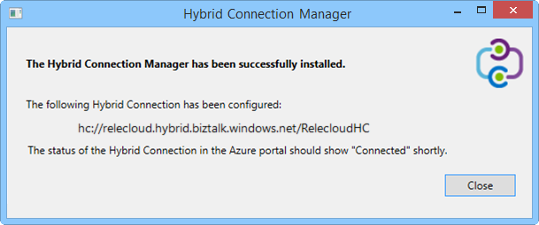
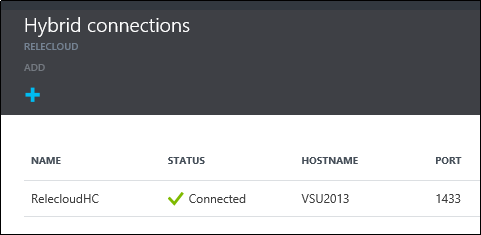

1. Na lâmina **conexões híbridos** , clique na conexão híbrido que você acabou de criar, clique em **Configuração de ouvinte**.
    
    
    
4. A lâmina de **Propriedades de conexão de híbrida** é aberta. Em **Gerenciador de Conexão de híbrido local**, escolha **baixar e configurar manualmente**, salve o pacote de HybridConnectionManager.msi baixado e copie a cadeia de conexão do gateway.
    
    
    
5. Em um prompt de comando do administrador, digite o seguinte comando para iniciar o instalador:

        start HybridConnectionManager.msi
 
7. Após a execução do instalador do, clique em **não agora**, navegue até a pasta %ProgramFiles%\Microsoft\HybridConnectionManager, execute HCMConfigWizard.exe e clique em **Sim** na caixa de diálogo **Controle de conta de usuário** .
        
7. Cole a cadeia de conexão híbrido que você copiou anteriormente e clique em **Okey**. 
    
    
    
8. Quando a instalação estiver concluída, clique em **Fechar**.
    
    
    
    Na lâmina **conexões híbrido** , a coluna **Status** mostra agora **conectado**. 
    
    