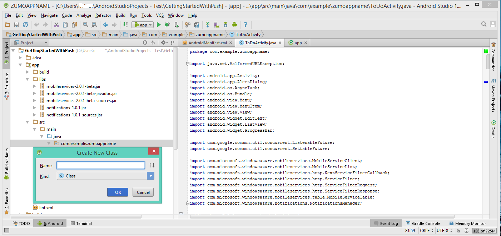

1. No seu projeto de **aplicativo** , abra o arquivo `AndroidManifest.xml`. No código das próximas duas etapas, substitua _`**my_app_package**`_ com o nome do pacote de aplicativo para o seu projeto, que é o valor da `package` atributo do `manifest` marca.

2. Adicione as seguintes novas permissões após a existente `uses-permission` elemento:

        <permission android:name="**my_app_package**.permission.C2D_MESSAGE"
            android:protectionLevel="signature" />
        <uses-permission android:name="**my_app_package**.permission.C2D_MESSAGE" />
        <uses-permission android:name="com.google.android.c2dm.permission.RECEIVE" />
        <uses-permission android:name="android.permission.GET_ACCOUNTS" />
        <uses-permission android:name="android.permission.WAKE_LOCK" />

3. Adicione o seguinte código após o `application` marca de abertura:

        <receiver android:name="com.microsoft.windowsazure.notifications.NotificationsBroadcastReceiver"
                                        android:permission="com.google.android.c2dm.permission.SEND">
            <intent-filter>
                <action android:name="com.google.android.c2dm.intent.RECEIVE" />
                <category android:name="**my_app_package**" />
            </intent-filter>
        </receiver>

4. Abra o arquivo *ToDoActivity.java*e adicione a seguinte instrução de importação:

        import com.microsoft.windowsazure.notifications.NotificationsManager;

5. Adicione a seguinte variável particular à classe: substituir _`<PROJECT_NUMBER>`_ com o número de projeto atribuído pelo Google para o seu aplicativo no procedimento anterior:

        public static final String SENDER_ID = "<PROJECT_NUMBER>";

6. Altere a definição do *MobileServiceClient* de **particular** para **estático público**, para que ele agora tem esta aparência:

        public static MobileServiceClient mClient;

7. Em seguida, precisamos adicionar uma nova classe para tratar notificações. No Explorador de projeto, abra o **src** => **principal** => **java** nós e com o botão direito no nó de nome do pacote: clique em **novo**, clique em **Classe Java**.

8. Em **nome** , digite `MyHandler`, clique em **Okey**.

    

9. No arquivo de MyHandler, substitua a declaração de classe com

        public class MyHandler extends NotificationsHandler {

10. Adicione as seguintes instruções de importação para o `MyHandler` classe:

        import com.microsoft.windowsazure.notifications.NotificationsHandler;
        import android.app.NotificationManager;
        import android.app.PendingIntent;
        import android.content.Context;
        import android.content.Intent;
        import android.os.AsyncTask;
        import android.os.Bundle;
        import android.support.v4.app.NotificationCompat;

11. Em seguida, adicione esse membro para o `MyHandler` classe:

        public static final int NOTIFICATION_ID = 1;

12. No `MyHandler` classe, adicione o seguinte código para substituir o método **onRegistered** , que registra o seu dispositivo com o Hub de notificação de serviço móvel.

        @Override
        public void onRegistered(Context context,  final String gcmRegistrationId) {
            super.onRegistered(context, gcmRegistrationId);

            new AsyncTask<Void, Void, Void>() {

                protected Void doInBackground(Void... params) {
                    try {
                        ToDoActivity.mClient.getPush().register(gcmRegistrationId);
                        return null;
                    }
                    catch(Exception e) {
                        // handle error             
                    }
                    return null;            
                }
            }.execute();
        }

13. No `MyHandler` classe, adicione o seguinte código para substituir o método **onReceive** , que causa a notificação para exibição quando for recebida.

        @Override
        public void onReceive(Context context, Bundle bundle) {
                String msg = bundle.getString("message");

                PendingIntent contentIntent = PendingIntent.getActivity(context,
                        0, // requestCode
                        new Intent(context, ToDoActivity.class),
                        0); // flags

                Notification notification = new NotificationCompat.Builder(context)
                        .setSmallIcon(R.drawable.ic_launcher)
                        .setContentTitle("Notification Hub Demo")
                        .setStyle(new NotificationCompat.BigTextStyle().bigText(msg))
                        .setContentText(msg)
                        .setContentIntent(contentIntent)
                        .build();

                NotificationManager notificationManager = (NotificationManager)
                        context.getSystemService(Context.NOTIFICATION_SERVICE);
                notificationManager.notify(NOTIFICATION_ID, notification);
        }

14. Voltar no arquivo TodoActivity.java, atualize o método **onCreate** da classe *ToDoActivity* para registrar a classe de manipulador de notificação. Certifique-se de adicionar este código após o *MobileServiceClient* é criada uma instância.

        NotificationsManager.handleNotifications(this, SENDER_ID, MyHandler.class);

    Seu aplicativo agora é atualizado para oferecer suporte a notificações por push.
