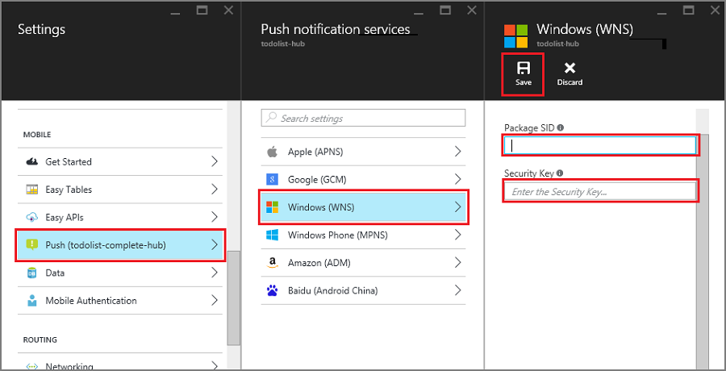

1. No [portal do Azure](https://portal.azure.com/), clique em **Procurar tudo** > **Os serviços de aplicativo** > seu back-end do aplicativo Mobile. Em **configurações**, clique em **Envio de serviço de aplicativo**, clique em seu nome de hub de notificação.

2. Vá para **Windows (WNS)**, insira a **chave de segurança** (secreta do cliente) e o **Pacote SID** que você obtidas no site de serviços do Live e clique em **Salvar**.

    

Seu back-end agora está configurado para usar o WNS para enviar notificações por push.
