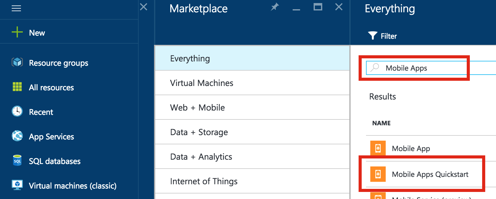

1. Logon no [Portal do Azure].

2. Clique em **+ novo** e digite **Aplicativos Mobile** em _pesquisa de mercado_. Selecione **Início rápido de aplicativos móveis** e clique em **criar**.

    

3. Para o **Grupo de recursos**, selecione um grupo de recursos existente ou crie um novo (usando o mesmo nome como seu aplicativo). 
 
4. Clique em **criar**. Aguarde alguns minutos para o serviço para ser implantado com êxito antes de continuar.

<!-- URLs. -->
[Portal do Azure]: https://portal.azure.com/
