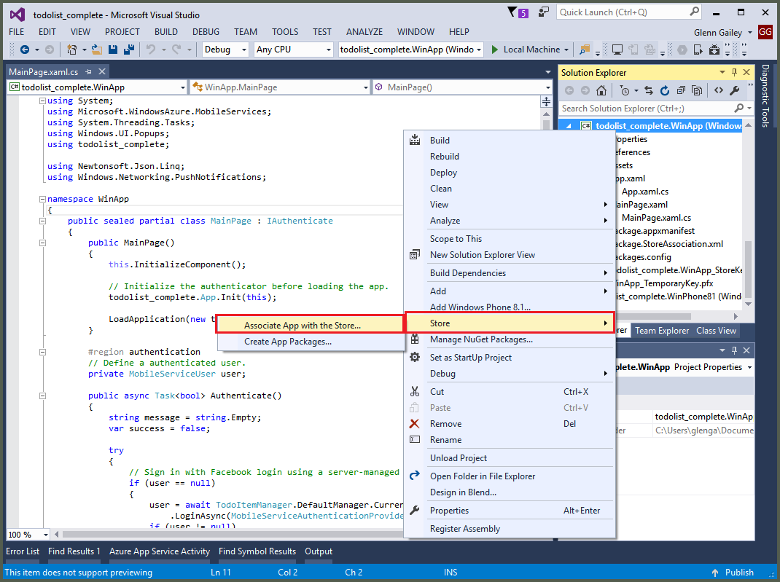
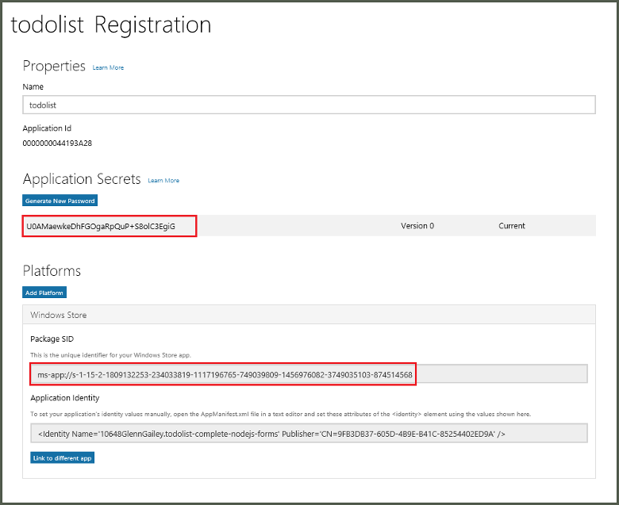

1. No Visual Studio Solution Explorer, clique com botão direito do projeto de aplicativo da Windows Store, clique em **repositório** > **Associar o aplicativo com o armazenamento de...**.

    

2. No assistente, clique em **Avançar**, entrar com sua conta da Microsoft, digite um nome para seu aplicativo em **reserva um novo nome de aplicativo**e clique em **reserva**.

3. Depois que o registro de aplicativo é criado com êxito, selecione o novo nome do aplicativo, clique em **Avançar**e, em seguida, clique em **associar**. Isso adiciona as informações de registro da Windows Store necessárias ao manifesto do aplicativo.

7. Repita as etapas 1 e 3 para o projeto de aplicativo do Windows Phone repositório usando o mesmo registro que você criou anteriormente para o aplicativo da Windows Store.  

7. Navegue até o [Centro de desenvolvimento do Windows](https://dev.windows.com/en-us/overview), entrar com sua conta da Microsoft, clique em novo registro de aplicativo em **Meus aplicativos**, expanda **Serviços** > **notificações por Push**.

8. Na página de **notificações de envio** , clique em **site de serviços do Live** em **Windows Push notificação Services (WNS) e aplicativos do Microsoft Azure Mobile**e anote os valores do **Pacote SID** e o valor *atual* em **Segredo do aplicativo**. 

    

    > [AZURE.IMPORTANT] O pacote SID e segredo do aplicativo são credenciais de segurança importantes. Não compartilhar esses valores com qualquer pessoa ou distribuí-los com seu aplicativo.
