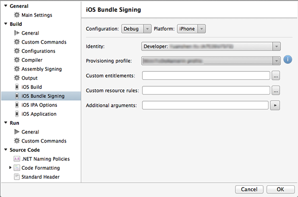
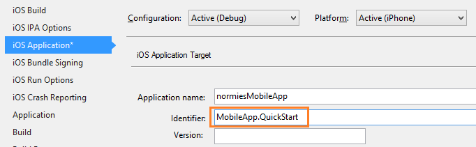

####Configurando o projeto iOS Xamarin Studio

1. Xamarin.Studio, abra **Info.plist**e atualize o **Identificador de pacote** com a ID de pacote que você criou anteriormente com sua nova ID de aplicativo.

    

2. Role para baixo até **Modos de plano de fundo** e marque a caixa **Habilitar modos de plano de fundo** e a caixa **notificações remotas** . 

    

3. Clique duas vezes seu projeto no painel solução para abrir **As opções de projeto**.

4.  Escolha **iOS pacote entrando** em **Construir**e selecione o correspondente **identidade** e **perfil de provisionamento** que você acabou de configurar para esse projeto. 

    

    Isso garante que o projeto usa o novo perfil para assinatura de código. Para o dispositivo Xamarin oficial documentação de provisionamento, consulte [Provisionamento de dispositivo Xamarin].

####Configurando o projeto de iOS no Visual Studio

1. No Visual Studio, clique com botão direito do projeto e, em seguida, clique em **Propriedades**.

2. Nas páginas de propriedades, clique na guia **iOS aplicativo** e atualize o **identificador** com a ID que você criou anteriormente.

    

3. Na guia **iOS assinatura de pacote** , selecione o correspondente **identidade** e **perfil de provisionamento** que você acabou de configurar para esse projeto. 

    

    Isso garante que o projeto usa o novo perfil para assinatura de código. Para o dispositivo Xamarin oficial documentação de provisionamento, consulte [Provisionamento de dispositivo Xamarin].

4. Clique duas vezes Info.plist para abri-lo e, em seguida, habilitar **RemoteNotifications** em modos de plano de fundo. 

[Configuração do dispositivo Xamarin]: http://developer.xamarin.com/guides/ios/getting_started/installation/device_provisioning/