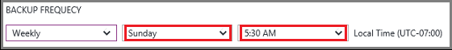

## Definir uma política de backup

Uma política de backup define uma matriz de quando os instantâneos de dados são realizados e por quanto tempo esses instantâneos são mantidos. Ao definir uma política para fazer backup de uma máquina virtual, você poderá disparar um trabalho de backup *uma vez por dia*. Quando você cria uma nova política, ela é aplicada ao cofre. A interface de política de backup tem esta aparência:

Para criar uma política:

1. Insira um nome para o **nome da política**.

2. Instantâneos dos seus dados podem ser criados em intervalos diária ou semanal. Use o menu suspenso **Frequência de Backup** para escolher se dados são criados instantâneos diária ou semanal.

    - Se você escolher um intervalo diário, use o controle realçado para selecionar a hora do dia de imagem. Para alterar a hora, desmarque a hora e selecione a nova hora.

      

    - Se você escolher um intervalo semanal, use os controles realçados para selecionar os dias da semana e a hora do dia para fazer o instantâneo. No menu do dia, selecione um ou vários dias. No menu de hora, selecione uma hora. Para alterar a hora, desmarque a hora selecionada e selecione a nova hora.

    

3. Por padrão, todas as opções de **Intervalo de retenção** são selecionadas. Desmarque qualquer limite de intervalo de retenção que você não deseja usar. Em seguida, especifique o interval(s) usar.

    Mensais e anuais intervalos de retenção permitem que você especifique os instantâneos com base em um incremento semanal ou diariamente.

    >[AZURE.NOTE] Ao proteger uma máquina virtual, um trabalho de backup é executado uma vez por dia. A hora em que o backup executa é o mesmo para cada intervalo de retenção.

4. Depois de definir todas as opções para a política, na parte superior da lâmina, clique em **Salvar**.

    A nova política é aplicada imediatamente ao cofre.
