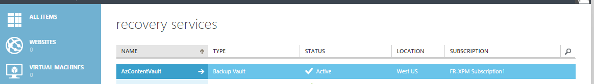
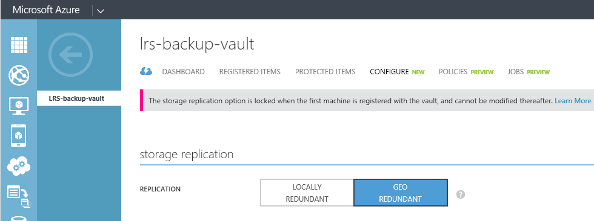

## Criar um Backup cofre
Para fazer backup de arquivos e dados do Windows Server ou Gerenciador de proteção de dados (DPM) para Azure ou ao fazer backup IaaS VMs em Azure, você deve criar um backup cofre na região geográfica onde você deseja armazenar os dados.

As etapas a seguir orientará você durante a criação de cofre usado para armazenar backups.

1. Entre [Portal de gerenciamento](https://manage.windowsazure.com/)
2. Clique em **novo** > **Serviços de dados** > **Serviços de recuperação** > **Cofre de Backup** e escolha **Criar rápida**.

    

3. Para o parâmetro de **nome** , digite um nome amigável para identificar o backup cofre. Isso deve ser exclusivo para cada assinatura.

4. Para o parâmetro de **região** , selecione a região geográfica para o backup cofre. A opção determina a região geográfica para que seus dados de backup são enviados. Escolhendo uma região geográfica Fechar para seu local, você pode reduzir a latência de rede ao fazer backup em Azure.

5. Clique em **Criar cofre** para concluir o fluxo de trabalho. Pode levar alguns instantes para o Cofre de backup a ser criado. Para verificar o status, você pode monitorar as notificações na parte inferior do portal.

    

6. Depois do cofre backup tiver sido criado, uma mensagem informa que o cofre foi criado com êxito. O cofre também está listado nos recursos dos serviços de recuperação como **ativa**.

    

### Azure Backup - opções de redundância de armazenamento

>[AZURE.IMPORTANT] O melhor horário para identificar sua opção de redundância de armazenamento é logo após a criação de cofre e antes de qualquer máquinas são registradas ao cofre. Depois que um item tiver sido registrado ao cofre, a opção de redundância de armazenamento está bloqueada e não pode ser modificada.

Suas necessidades de negócios devem determinar a redundância de armazenamento do armazenamento do Azure Backup back-end. Se você estiver usando o Azure como um ponto de extremidade de armazenamento de backup principal (por exemplo, você estiver fazendo backup para Azure de um Windows Server), você deve considerar (padrão) de separação geográfica redundantes opção de armazenamento. Isso é visto na opção **Configurar** de seu Cofre de Backup.

#### Armazenamento de localização geográfica redundantes (GRS)
GRS mantém seis cópias de seus dados. Com GRS, seus dados são replicados três vezes dentro da região principal e também são replicados três vezes em uma região secundária centenas de milhas longe da região primária, fornecendo o nível mais alto de durabilidade. Em caso de falha na região primária, armazenando dados em GRS, Backup do Azure garante que seus dados estiverem duráveis em duas regiões separadas.

#### Armazenamento localmente redundante (LRS)
Armazenamento localmente redundante (LRS) mantém três cópias de seus dados. LRS é replicado três vezes dentro de um único recurso em uma única região. LRS protege seus dados contra falhas de hardware normal, mas não da falha de um recurso de Azure inteiro.

Se você estiver usando o Azure como um ponto de extremidade de armazenamento de backup terceira (por exemplo, estiver usando SCDPM para fazer um backup local copiar local & uso do Azure para necessidades de retenção a longo prazo), você deve considerar escolhendo localmente armazenamento redundante da opção **Configurar** de seu Cofre de Backup. Isto traz o custo de armazenamento de dados no Azure, fornecendo um nível inferior de durabilidade para seus dados que podem ser aceitáveis para a terceira cópias.

