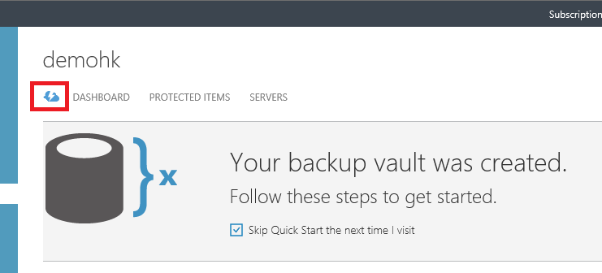

## Usando as credenciais do cofre para autenticar com o serviço de Backup do Azure

O servidor de local (Windows cliente ou servidor Windows Server ou Gerenciador de proteção de dados) precisa ser autenticada com um cofre backup antes que ele pode fazer backup de dados no Azure. A autenticação é alcançada usando "cofre credenciais". O conceito de credenciais do cofre é semelhante ao conceito de um arquivo "configurações de publicação", que é usado no Azure PowerShell.

### O que é o arquivo de credencial cofre?

O arquivo de credenciais do cofre é um certificado gerado pelo portal para cada compartimento backup. O portal carrega a chave pública para o serviço de controle de acesso (ACS). A chave privada do certificado é disponibilizada para o usuário como parte do fluxo de trabalho que é fornecido como uma entrada do fluxo de trabalho de registro de máquina. Isso autentica a máquina para enviar dados de backup para um cofre identificado no serviço do Azure Backup.

A credencial cofre é usada somente durante o fluxo de trabalho de registro. É responsabilidade do usuário para garantir que o arquivo de credenciais do Cofre não seja comprometido. Se ela estiver em mãos de qualquer usuário autorizados, o arquivo de credenciais do cofre pode ser usado para registrar outras máquinas contra o mesmo cofre. No entanto, como os dados de backup são criptografados usando uma senha que pertence ao cliente, dados de backup existentes não podem ser comprometidos. Para atenuar esse problema, cofre credenciais são definidas para expirar em 48hrs. Você pode baixar as credenciais de Cofre de um backup cofre qualquer número de vezes – mas apenas o arquivo mais recente da credencial cofre é aplicável durante o fluxo de trabalho de registro.

### Baixar o arquivo de credencial do cofre

O arquivo de credencial cofre é baixado por meio de um canal seguro do portal do Azure. O serviço de Backup do Azure não tem conhecimento da chave privada do certificado e a chave privada não é mantida no portal do ou o serviço. Use as etapas a seguir para baixar o arquivo de credencial do cofre para um computador local.

1.  Entre [Portal de gerenciamento](https://manage.windowsazure.com/)
2.  Clique em **Serviços de recuperação** no painel de navegação à esquerda e selecione o Cofre de backup que você criou. Clique no ícone de nuvem para acessar o modo de exibição de início rápido do Cofre de backup.

    

3.  Na página de início rápido, clique em **credenciais do Cofre de Download**. O portal gera o arquivo de credencial cofre, que é disponibilizado para download.

    

4.  O portal gerará uma credencial de cofre usando uma combinação do nome do cofre e a data atual. Clique em **Salvar** para baixar as credenciais do cofre para a pasta de downloads da conta local, ou selecione Salvar como no menu Salvar para especificar um local para as credenciais do cofre.

### Observação
- Certifique-se de que as credenciais do cofre seja salvo em um local que pode ser acessado da sua máquina. Se ele estiver armazenado em um compartilhamento de arquivo/SMB, verifique as permissões de acesso.
- O arquivo de credenciais do cofre é usado somente durante o fluxo de trabalho de registro.
- O arquivo de credenciais do cofre expira após 48hrs e pode ser baixado a partir do portal.
- Consulte o Backup do Azure [perguntas Frequentes](../articles/backup/backup-azure-backup-faq.md) de dúvidas sobre o fluxo de trabalho.
