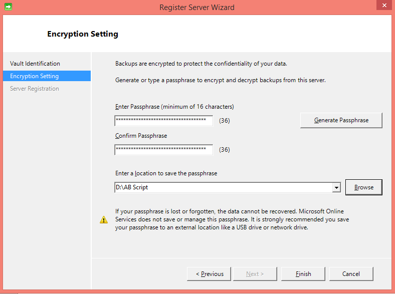

## Baixar, instalar e registrar o agente de Backup do Azure

Depois de criar o Cofre de Backup do Azure, um agente deve ser instalado em cada uma das suas máquinas do Windows (Windows Server, cliente Windows, Gerenciador de proteção de dados do System Center server ou máquina de servidor de Backup do Azure) que permite fazer backup de dados e aplicativos para o Azure.

1. Entre [Portal de gerenciamento](https://manage.windowsazure.com/)

2. Clique em **Serviços de recuperação**e selecione o Cofre de backup que você deseja registrar com um servidor. A página de início rápido para que os backup aparece.

    

3. Na página de início rápido, clique na opção **para o Windows Server, Gerenciador de proteção de dados do System Center ou cliente Windows** em **Agente de Download**. Clique em **Salvar** para copiá-lo no computador local.

    

4. Quando o agente estiver instalado, clique duas vezes MARSAgentInstaller.exe para iniciar a instalação do agente de Backup do Azure. Escolha a pasta de instalação e a pasta de rascunho necessários para o agente. O local do cache especificado deve ter espaço livre, que é pelo menos 5% dos dados de backup.

5.  Se você usar um servidor proxy para se conectar à internet, na tela de **configuração de Proxy** , insira os detalhes do servidor de proxy. Se você usar um proxy autenticado, insira os detalhes de nome e senha de usuário nesta tela.

6.  O agente de Backup do Azure instala o .NET Framework 4,5 e Windows PowerShell (se ainda não estiver disponível) para concluir a instalação.

7.  Quando o agente estiver instalado, clique no botão **prosseguir para o registro** para continuar com o fluxo de trabalho.

    

8. Na tela de credenciais do cofre, navegue até e selecione o arquivo de credenciais do cofre que foi baixado anteriormente.

    

    O arquivo de credenciais do cofre só é válido para 48 horas (depois de baixado do portal). Se você encontrar qualquer erro nessa tela (por exemplo "arquivo de credenciais do cofre fornecida expirou"), faça logon no Azure portal e baixar o arquivo de credenciais do cofre novamente.

    Certifique-se de que o arquivo de credenciais do cofre está disponível em um local que pode ser acessado pelo aplicativo de instalação. Se você encontrar erros relacionados de acesso, copie o arquivo de credenciais do cofre para um local temporário nesta máquina e repita a operação.

    Se você encontrar um erro de credencial de Cofre inválido (por exemplo, "credencial de Cofre inválido fornecido") o arquivo está corrompido ou não tiver as credenciais mais recentes associado com o serviço de recuperação. Repita a operação após fazer o download de um novo arquivo de credencial do cofre a partir do portal. Esse erro geralmente é visto se o usuário clicar na opção de **credencial de Cofre de Download** no portal do Azure, sucessivamente rápida. Nesse caso, somente o segundo arquivo de credencial de cofre é válido.

9. Na tela de **configuração de criptografia** , você pode gerar uma senha ou fornecer uma senha (mínimo de 16 caracteres). Lembre-se de salvar a senha em um local seguro.

    

    > [AZURE.WARNING] Se a senha é perdida ou esquecida; Microsoft não pode ajudar na recuperação de dados de backup. O usuário final possui a senha de criptografia e a Microsoft não tem visibilidade a senha usada pelo usuário final. Salve o arquivo em um local seguro, como ele é necessário durante uma operação de recuperação.

10. Quando você clicar no botão **Concluir** , máquina é registrada com êxito para o compartimento e agora você está pronto para iniciar o backup do Microsoft Azure.

11. Ao usar o Microsoft Azure Backup autônomo, você pode modificar as configurações especificadas durante o fluxo de trabalho de registro clicando na opção **Alterar propriedades** no snap in mmc do Backup do Azure.

    

    Como alternativa, ao usar o Gerenciador de proteção de dados, você pode modificar as configurações especificadas durante o fluxo de trabalho de registro clicando na opção de **Configurar** selecionando **Online** sob a guia de **gerenciamento** .

    
