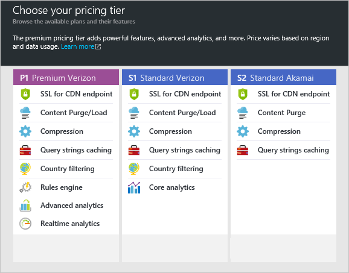

**Para criar um novo perfil CDN**

1. No [Portal do Azure](https://portal.azure.com), no canto superior esquerdo, clique em **novo**.  Na lâmina **novo** , selecione **mídia + CDN**, **CDN**.

    A nova lâmina de perfil CDN é exibida.

    

2. Insira um nome para o seu perfil CDN.

3. Selecione um **local**.  Este é o Azure local onde suas informações de perfil CDN serão armazenadas.  Ele não tem impacto em locais de ponto de extremidade CDN.

4. Selecione ou crie um **Grupo de recursos**.  Para obter mais informações sobre grupos de recursos, consulte [Visão geral do Gerenciador de recursos do Azure](resource-group-overview.md#resource-groups).

5. Selecione um **nível de preços**.  Consulte [Visão geral de CDN](cdn-overview.md#azure-cdn-features) a comparação de níveis de preços.
    
    

6. Selecione a **assinatura** para este perfil CDN.

7. Clique no botão **criar** para criar o novo perfil. 