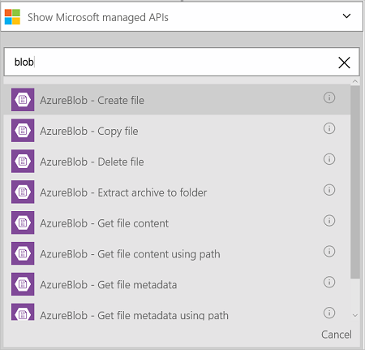

### Pré-requisitos
- Uma conta do Azure; Você pode criar uma [conta gratuita](https://azure.microsoft.com/free)
- Uma [conta de armazenamento de Blob do Azure](../articles/storage/storage-create-storage-account.md) incluindo o nome da conta de armazenamento e sua chave de acesso. Esta informação é listada nas propriedades da conta de armazenamento no portal do Azure. Leia mais sobre [O armazenamento do Azure](../articles/storage/storage-introduction.md).

Antes de usar sua conta de armazenamento de Blob do Azure em um aplicativo de lógica, conecte à sua conta de armazenamento de Blob do Azure. Você pode fazer isso facilmente dentro de seu aplicativo de lógica no portal do Azure.  

Conectar-se à sua conta de armazenamento de Blob do Azure usando as seguintes etapas:  

1. Crie um aplicativo de lógica. No criador de aplicativos de lógica, adicionar um disparador e adicione uma ação. Selecione **Mostrar Microsoft APIs gerenciadas** na lista suspensa e insira "blob" na caixa de pesquisa. Selecione uma das ações:  

      

2. Se você ainda não criou anteriormente qualquer conexões para armazenamento do Azure, você será solicitado para os detalhes de conexão:   

      

3. Insira os detalhes da conta de armazenamento. Propriedades com um asterisco são necessárias.

    | Propriedade | Detalhes |
|---|---|
| Nome de Conexão * | Insira um nome para sua conexão. |
| Nome da conta de armazenamento do Azure * | Insira o nome da conta de armazenamento. O nome da conta de armazenamento é exibido nas propriedades de armazenamento no portal do Azure. |
| Tecla de acesso de conta de armazenamento do Azure * | Insira a chave de conta de armazenamento. As teclas de acesso são exibidas as propriedades de armazenamento no portal do Azure. |

    Essas credenciais são usadas para autorizar seu aplicativo de lógica para conectar-se e acessar seus dados. 

4. Selecione **criar**.

5. Observe que a conexão tiver sido criado. Agora, continue com as outras etapas em seu aplicativo de lógica: 

      
