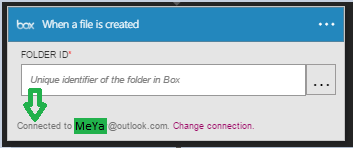

### Pré-requisitos

- Uma conta de [caixa](http://box.com)  

Antes de poder usar sua conta de caixa em um aplicativo de lógica, você deve autorizar o aplicativo de lógica para se conectar à sua conta de caixa. Felizmente, você pode fazer isso facilmente a partir de dentro de seu aplicativo de lógica no Portal do Azure.  

Aqui estão as etapas para autorizar seu aplicativo de lógica para se conectar à sua conta de caixa:  
1. Para criar uma conexão à caixa, no designer de aplicativo de lógica, selecione **Mostrar Microsoft APIs gerenciadas** na lista suspensa e digite *caixa* na caixa de pesquisa. Selecione o disparador ou a ação que você gostará usar:  
  
2. Se você ainda não tiver criado quaisquer conexões caixa antes, você vai obter solicitado a fornecer suas credenciais de caixa. Essas credenciais serão usadas para autorizar seu aplicativo lógica para se conectar ao e acessam os dados da sua conta de caixa:  
  
3. Forneça seu nome de usuário de caixa e a senha para autorizar seu aplicativo de lógica:  
   
4. Permitir conosco para se conectar à caixa:  
  
5. Observe que a conexão tiver sido criado e agora você está livre para continuar com as outras etapas em seu aplicativo de lógica:  
  
