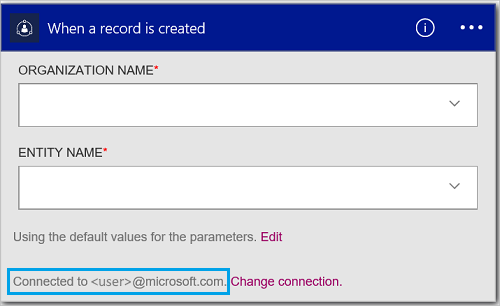

#### Pré-requisitos
- Uma conta do Azure; Você pode criar uma [conta gratuita](https://azure.microsoft.com/free)
- Uma conta do [Dynamics CRM Online](https://www.microsoft.com/en-us/dynamics/crm-free-trial-overview.aspx) 

Antes de usar sua conta do Dynamics em um aplicativo de lógica, autorize o aplicativo de lógica para se conectar à sua conta do CRM Online. Você pode fazer isso facilmente dentro de seu aplicativo de lógica no portal do Azure. 

Autorize seu aplicativo lógica para se conectar à sua conta CRM Online usando as seguintes etapas:

1. Crie um aplicativo de lógica. No designer lógica aplicativos, selecione **Mostrar Microsoft APIs gerenciadas** na lista suspensa e insira "dynamics" na caixa de pesquisa. Selecione um dos disparadores ou ações:  
  
2. Se você ainda não criou anteriormente todas as conexões ao Dynamics, você será solicitado a entrar usando suas credenciais do Dynamics:  
  
3. Selecione **entrar**e insira seu nome de usuário e senha. Selecione **entrar**. 

    Essas credenciais são usadas para autorizar seu aplicativo de lógica conectem e acessar os dados em sua conta do Dynamics. 
4. Observe que a conexão tiver sido criado. Agora, continue com as outras etapas em seu aplicativo de lógica:  
  
