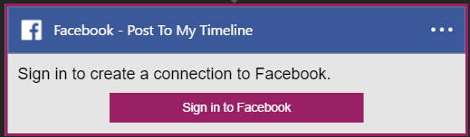

### Pré-requisitos
- Uma conta do [Facebook](https://www.facebook.com/) 

Antes de poder usar sua conta do Facebook em um aplicativo de lógica, você deve autorizar o aplicativo de lógica para se conectar à sua conta do Facebook. Felizmente, você pode fazer isso facilmente a partir de dentro de seu aplicativo de lógica no Portal do Azure. 

Aqui estão as etapas para autorizar seu aplicativo de lógica para se conectar à sua conta do Facebook:

1. Para criar uma conexão com o Facebook, no designer de aplicativo de lógica, selecione **Mostrar Microsoft APIs gerenciadas** na lista suspensa e digite *Facebook* na caixa de pesquisa. Selecione o disparador ou a ação que você gostará usar:  
  
2. Se você ainda não criou qualquer conexões com o Facebook antes, você vai obter solicitado a fornecer suas credenciais do Facebook. Essas credenciais serão usadas para autorizar seu aplicativo de lógica para se conectar ao e acessam os dados da sua conta do Facebook:  
  
3. Forneça seu nome de usuário do Facebook e a senha para autorizar seu aplicativo de lógica:  
     
4. Observe que a conexão tiver sido criado e agora você está livre para continuar com as outras etapas em seu aplicativo de lógica:  
     
