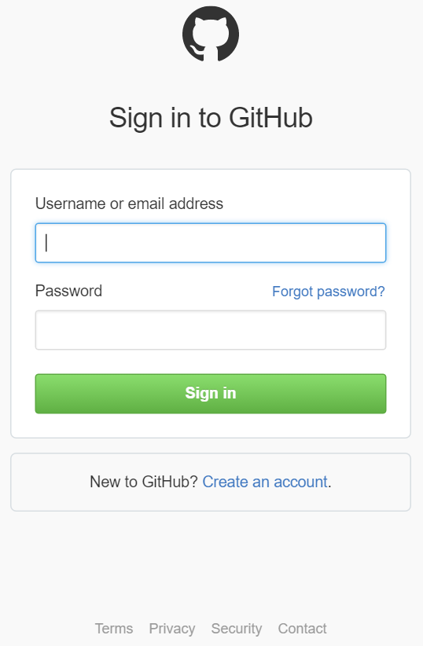

### Pré-requisitos
- Uma conta de [GitHub](http://GitHub.com) 

Antes de poder usar sua conta GitHub em um aplicativo de lógica, você deve autorizar o aplicativo de lógica para se conectar à sua conta de GitHub. Felizmente, você pode fazer isso facilmente a partir de dentro de seu aplicativo de lógica no Portal do Azure. 

Aqui estão as etapas para autorizar seu aplicativo de lógica para se conectar à sua conta de GitHub:

1. Para criar uma conexão para GitHub, no designer de aplicativo de lógica, selecione **Mostrar Microsoft APIs gerenciadas** na lista suspensa e digite *GitHub* na caixa de pesquisa. Selecione o disparador ou a ação que você gostará usar:  
  
2. Se você ainda não criou as conexões GitHub antes, você vai obter solicitado a fornecer suas credenciais GitHub. Essas credenciais serão usadas para autorizar seu aplicativo de lógica para se conectar ao e acessam os dados da sua conta GitHub:  
  
3. Forneça seu GitHub nome de usuário e senha para autorizar seu aplicativo de lógica:  
     
4. Confirme sua intenção:  
     
5. Observe que a conexão tiver sido criado no portal. Agora, você pode continuar com a criação de seu aplicativo de lógica e usando o GitHub nele:   
     
