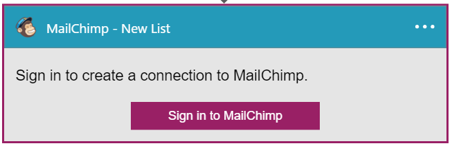
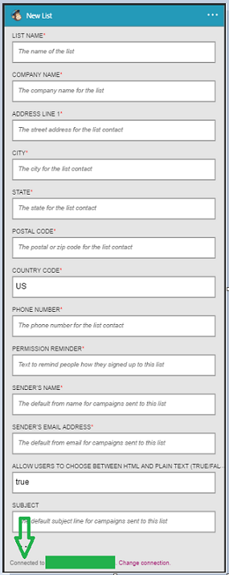

### Pré-requisitos
- Uma conta de [MailChimp](https://www.MailChimp.com/) 

Antes de poder usar sua conta de MailChimp em um aplicativo de lógica, você deve autorizar o aplicativo de lógica para se conectar à sua conta de MailChimp. Felizmente, você pode fazer isso facilmente a partir de dentro de seu aplicativo de lógica no Portal do Azure. 

Aqui estão as etapas para autorizar seu aplicativo de lógica para se conectar à sua conta de MailChimp:

1. Para criar uma conexão para MailChimp, no designer de aplicativo de lógica, selecione **Mostrar Microsoft APIs gerenciadas** na lista suspensa e digite *MailChimp* na caixa de pesquisa. Selecione o disparador ou a ação que você gostará usar:  
  
2. Se você ainda não criou as conexões MailChimp antes, você vai obter solicitado a fornecer suas credenciais de MailChimp. Essas credenciais serão usadas para autorizar seu aplicativo de lógica para se conectar ao e acessam os dados da sua conta de MailChimp:  
  
3. Forneça seu MailChimp nome de usuário e senha para autorizar seu aplicativo de lógica:  
     
4. Observe que a conexão tiver sido criado e agora você está livre para continuar com as outras etapas em seu aplicativo de lógica:  
  
