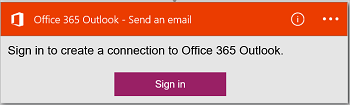
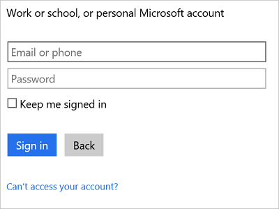

#### Pré-requisitos
- Uma conta do Azure; Você pode criar uma [conta gratuita](https://azure.microsoft.com/free)
- Uma conta do [Office 365](https://office365.com)  

Antes de usar sua conta do Office 365 em um aplicativo de lógica, autorize o aplicativo de lógica para se conectar à sua conta do Office 365. Você pode fazer isso facilmente dentro de seu aplicativo de lógica no portal do Azure.  

Autorize seu aplicativo de lógica para se conectar à sua conta do Office 365 usando as seguintes etapas:

1. Crie um aplicativo de lógica. No designer lógica aplicativos, selecione **Mostrar Microsoft APIs gerenciadas** na lista suspensa e insira "office 365" na caixa de pesquisa. Selecione um dos disparadores ou ações:  
      

2. Se você ainda não criou anteriormente todas as conexões para o Office 365, você será solicitado a entrar usando suas credenciais do Office 365:  
      

3. Selecione **entrar**e insira seu nome de usuário e senha. Selecione **entrar**:  
    

    Essas credenciais são usadas para autorizar seu aplicativo de lógica conectem e acessar sua conta do Office 365. 

4. Observe que a conexão tiver sido criado. Agora, continue com as outras etapas em seu aplicativo de lógica:   
      
  