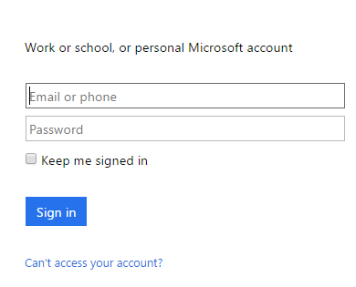

### Pré-requisitos

- Uma conta de [Vídeo do Office 365](https://support.office.com/article/Meet-Office-365-Video-ca1cc1a9-a615-46e1-b6a3-40dbd99939a6)  

Antes de poder usar sua conta de vídeo do Office 365 em um aplicativo de lógica, você deve autorizar o aplicativo de lógica para se conectar à sua conta de vídeo do Office 365. Felizmente, você pode fazer isso facilmente a partir de dentro de seu aplicativo de lógica no Portal do Azure.  

Aqui estão as etapas para autorizar seu aplicativo de lógica para se conectar à sua conta de vídeo do Office 365:  
1. Para criar uma conexão para o vídeo do Office 365, no designer de aplicativo de lógica, selecione **Mostrar Microsoft APIs gerenciadas** na lista suspensa e insira o *Vídeo do Office 365* na caixa de pesquisa. Selecione o disparador ou a ação que você gostará usar:  
  
2. Se você ainda não criou qualquer conexões com vídeo do Office 365 antes, você vai obter solicitado a fornecer suas credenciais de vídeo do Office 365. Essas credenciais serão usadas para autorizar seu aplicativo de lógica para se conectar ao e acessam os dados da sua conta de vídeo do Office 365:  
  
3. Forneça suas credenciais para se conectar ao vídeo do Office 365:  
   
4. Observe que a conexão tiver sido criado e agora você está livre para continuar com as outras etapas em seu aplicativo de lógica:  
  
