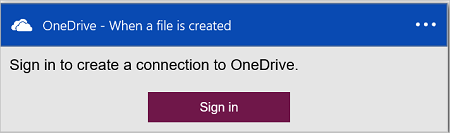

#### Pré-requisitos
- Uma conta do Azure; Você pode criar uma [conta gratuita](https://azure.microsoft.com/free)
- Uma conta do [OneDrive](https://www.microsoft.com/store/apps/onedrive/9wzdncrfj1p3) 

Antes de poder usar sua conta do OneDrive em um aplicativo de lógica, autorize o aplicativo de lógica para se conectar à sua conta do OneDrive.  Você pode fazer isso facilmente dentro de seu aplicativo de lógica no portal do Azure. 

Autorize seu aplicativo de lógica para se conectar à sua conta do OneDrive usando as seguintes etapas:

1. Crie um aplicativo de lógica. No designer lógica aplicativos, selecione **Mostrar Microsoft APIs gerenciadas** na lista suspensa e digite "onedrive" na caixa de pesquisa. Selecione um dos disparadores ou ações:  
  
2. Se você ainda não criou anteriormente todas as conexões para o OneDrive, você será solicitado a entrar usando suas credenciais do OneDrive:  
  
3. Selecione **entrar**e insira seu nome de usuário e senha. Selecione **entrar**:  
     

    Essas credenciais são usadas para autorizar seu aplicativo de lógica conectem e acessar os dados em sua conta do OneDrive. 
4. Selecione **Sim** para autorizar o aplicativo de lógica para usar sua conta do OneDrive:  
     
5. Observe que a conexão tiver sido criado. Agora, continue com as outras etapas em seu aplicativo de lógica:  
  
