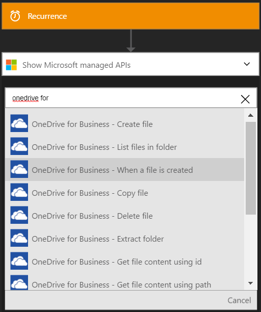

### Pré-requisitos
- Uma conta do [OneDrive](http://OneDrive.com) 

Antes de poder usar o OneDrive para a conta de negócios em um aplicativo de lógica, você deve autorizar o aplicativo de lógica para se conectar à sua conta do OneDrive for Business. Felizmente, você pode fazer isso facilmente a partir de dentro de seu aplicativo de lógica no Portal do Azure. 

Aqui estão as etapas para autorizar seu aplicativo de lógica para se conectar à sua conta do OneDrive for Business:

1. Para criar uma conexão para o OneDrive for Business, no designer de aplicativo de lógica, selecione **Mostrar Microsoft APIs gerenciadas** na lista suspensa e digite o *SkyDrive Pro* na caixa de pesquisa. Selecione o disparador ou a ação que você gostará usar:  
  
2. Se você ainda não tiver criado quaisquer conexões onedrive for Business antes, você vai obter solicitado a fornecer seu OneDrive credenciais de negócios. Essas credenciais serão usadas para autorizar seu aplicativo de lógica para se conectar ao e acessar seu OneDrive for dados da conta da empresa:  
  
3. Forneça seu OneDrive Business nome de usuário e senha para autorizar seu aplicativo de lógica:  
     
4. Observe que a conexão tiver sido criado e agora você está livre para continuar com as outras etapas em seu aplicativo de lógica:  
     
