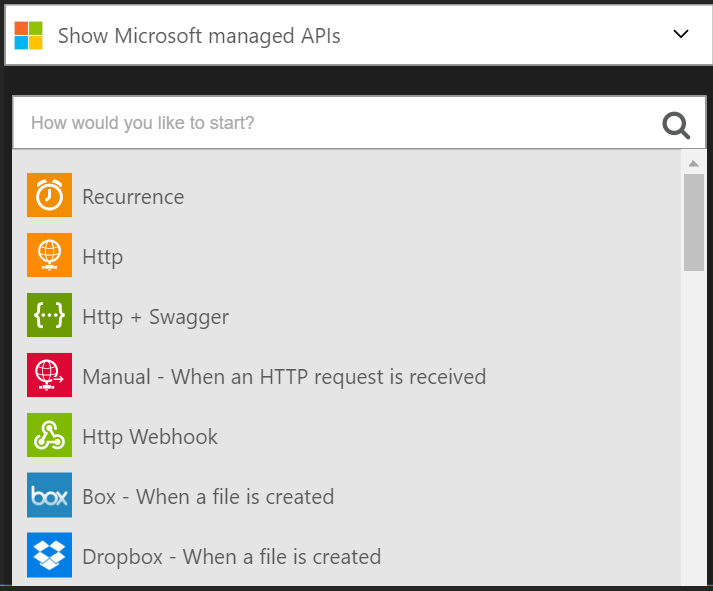

## Conectar ao site Outlook.com

### Pré-requisitos
- Uma conta do Outlook.com

Antes de poder usar sua conta do Outlook.com em um aplicativo de lógica, você deve autorizar o aplicativo de lógica para se conectar à sua conta do Outlook.com. Felizmente, você pode fazer isso facilmente a partir de dentro de seu aplicativo de lógica no Portal do Azure. 

Aqui estão as etapas para autorizar seu aplicativo de lógica para se conectar à sua conta do Outlook.com:

1. Todos os aplicativos de lógica precisam ser iniciado por um disparador para que depois que você criar seu aplicativo de lógica, o designer abre e exibe uma lista de disparadores que você pode usar para iniciar seu aplicativo de lógica:

  
2. Digite "outlook" na caixa de pesquisa. Observe que a lista é filtrada para listar todos os disparadores com "Outlook" no nome:
3. Selecione o **Office 365 Outlook - em novo email**.   
  Se você ainda não criou qualquer conexões com o Outlook antes, você vai obter solicitado a fornecer suas credenciais do Outlook.com. Essas credenciais serão usadas para autorizar seu aplicativo de lógica para se conectar ao e acessam os dados da sua conta do Outlook.com:
4. Fornecer suas credenciais para o Outlook e entrar:  
  É isso. Agora que você criou uma conexão ao Outlook. Esta conexão estará disponível para uso em qualquer outro aplicativo de lógica que você criar.

