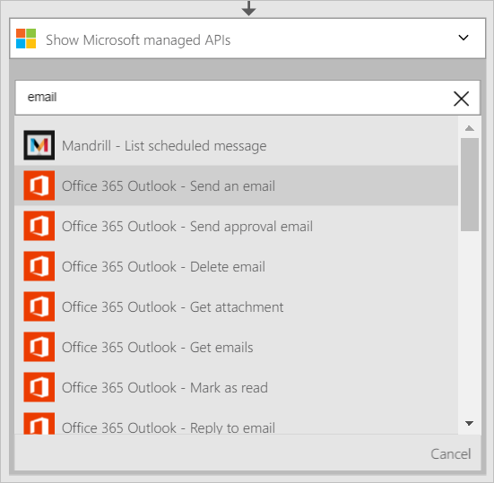

Agora que você adicionou uma condição, é hora de fazer algo interessante com os dados que são gerados pelo disparador. Siga estas etapas para adicionar a ação de **Salesforce - obter objeto** . Esta ação obterá os dados de cada vez que um novo cliente potencial é criado. Você também adicionará uma segunda ação que usará os dados da equipe de vendas do - obter uma ação do objeto para enviar um email usando o conector do Office 365.  

Para configurar esta ação, você precisará fornecer as seguintes informações. Você notará que é fácil de usar dados gerados pelo disparador como entrada para algumas das propriedades para o novo arquivo:

|Criar propriedade de arquivo|Descrição|
|---|---|
|Tipo de objeto|Este é o tipo de objeto de Salesforce que você está interessado. Exemplos são cliente potencial, conta, etc.|
|ID do objeto|Isso representa um identificador para o objeto.|

1. Selecione o link **Adicionar uma ação** . Isso abre a caixa de pesquisa onde você pode pesquisar qualquer ação que você gostaria de fazer. Neste exemplo, Salesforce ações são de interesse.      
  
- Digite *salesforce* para procurar as ações relacionadas à equipe de vendas.
- Selecione **Salesforce - obter objeto** como a ação a ser executada.   **Observação**: você será solicitado a autorizar seu aplicativo de lógica para acessar sua conta de Salesforce se você não tiver feito isso anteriormente.    
    
- O controle de **obter objeto** abre.  
- Selecione o *cliente potencial* como o tipo de objeto.
- Selecione o controle de **ID do objeto** .
- Selecione **…** para expandir a lista de símbolos que podem ser usados como entrada para ações.       
    
- Selecione controle de **ID do cliente potencial** é aberta.   
     
- Observe que o token de ID de cliente potencial é agora no controle de ID do objeto, indicando que a ação do objeto Get irá procurar um cliente potencial com uma identificação que é igual à ID de cliente potencial de cliente potencial que disparou este aplicativo lógica.  
  
- Salve seu trabalho. Isso, você adicionou a ação do objeto Get ao seu aplicativo de lógica. Controlar seu objeto deve ter esta aparência:    
  

Agora que você adicionou uma ação para obter um cliente potencial, talvez você queira fazer algo interessante com o cliente potencial recém-criado. Em uma empresa, talvez você queira enviar um email para uma lista de distribuição de notificação que um novo cliente potencial foi criado. Vamos usar o conector do Office 365 para enviar um email com algumas das informações relevantes do novo objeto cliente potencial em Salesforce.  

1. Selecione **Adicionar uma ação** , depois digite *email* na controle de pesquisa. Isso filtra as ações para aqueles que estão relacionadas a enviar e receber email.  
- Selecione o item de lista do **Office 365 Outlook - enviar um email** . Se você ainda não tiver criado uma *conexão* à sua conta do Office 365, você será solicitado a inserir suas credenciais do Office 365 para criá-lo agora. Depois de terminar, o controle de **Enviar um email** abre.        
  
- Insira o endereço de email que você gostaria de enviar email no controle **para** .
-  No controle **assunto** , insira o *novo cliente potencial criado* - e selecione o símbolo de *empresa* . Isso exibirá o campo *empresa* do novo cliente potencial criado em Salesforce.  
-  No controle de **corpo** , você pode selecionar qualquer uma dos tokens do novo objeto de cliente potencial e também é possível inserir qualquer texto que você deseja exibir no corpo do email. Aqui está um exemplo:  
   
- Salve seu fluxo de trabalho.  

É isso. Seu aplicativo de lógica agora está concluído.  

Agora, você pode testar seu aplicativo de lógica: na equipe de vendas, crie um novo cliente potencial que atenda à condição que você criou.  Se você seguiu deste detalhado totalmente, basta crie um cliente potencial com um endereço de email que contenha *amazon.com* nele. Após alguns segundos seu aplicativo de lógica deve ser disparado e os resultados podem parecer semelhantes a esta:  
  

