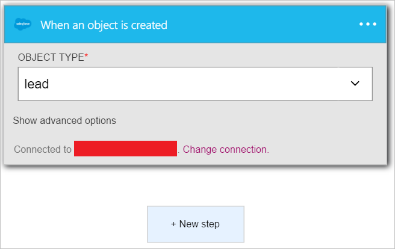
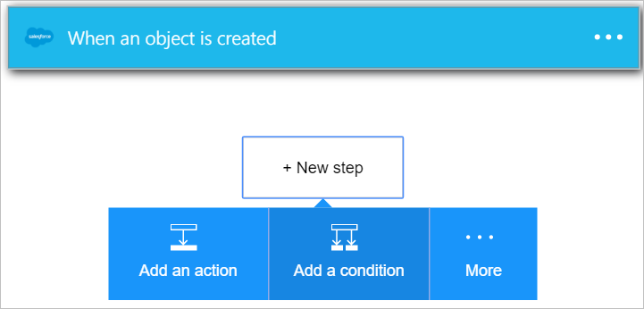
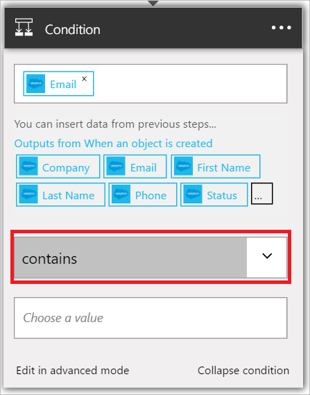

Esta condição irá avaliar o campo de endereço de email de cada novo líder de equipe de vendas. Se o endereço de email contém *amazon.com*, o resultado de condição será *verdadeira*.

1. Selecione **+ nova etapa**.  
   
- Selecione **Adicionar uma condição**.    
  
- Selecione **Escolher um valor**.    
  
- Selecione o símbolo de *Email* do cliente potencial do disparador.    
  
- Selecione *contém*.      
  
- Selecione **Escolher um valor** na parte inferior do controle.     
  
- Insira *amazon.com* como o valor que você gostaria de avaliar o endereço de email do novo cliente potencial. Se o endereço de email contém *amazon.com*, a condição será avaliada como *True* e as outras etapas em seu aplicativo de lógica poderá continuar.    
  
- Salve seus aplicativos de lógica.  

