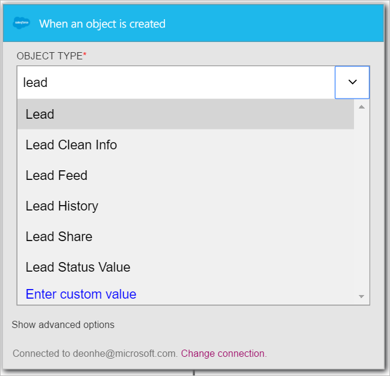

Este passo a passo, você aprenderá como usar o disparador **Salesforce - quando um objeto é criado** para iniciar um fluxo de trabalho do aplicativo de lógica quando um novo cliente potencial é criado em sua equipe de vendas.

>[AZURE.NOTE]Você será solicitado que entre na sua conta de Salesforce se você já não tiver criado uma *conexão* com a equipe de vendas.  

1. Insira *salesforce* na caixa de pesquisa no designer de aplicativos de lógica e selecione o disparador **Salesforce - quando um objeto é criado** .  
   
- O controle **quando um objeto é criado** é exibido.  
   
- Selecione o **Tipo de objeto** e *conduzir* na lista de objetos. Nesta etapa, você está indicando que você está criando um disparador que notificará seu aplicativo de lógica sempre que um novo cliente potencial é criado no Salesforce.   
   
- É isso. Você criou o disparador. No entanto, você precisa criar pelo menos uma ação para fazer isso em um aplicativo de lógica válida.    
   

Neste ponto, seu aplicativo de lógica foi configurado com um disparador que iniciará uma execução de outros disparadores e as ações no fluxo de trabalho quando um novo item é criado em sua equipe de vendas.  