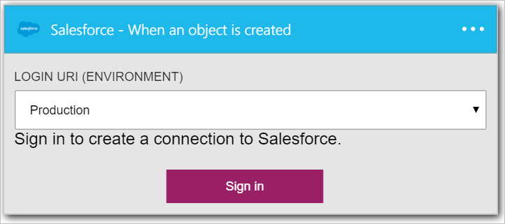

### Pré-requisitos

- Uma conta de [Salesforce](https://salesforce.com)  

Antes de poder usar sua conta de Salesforce em um aplicativo de lógica, você deve autorizar o aplicativo de lógica para se conectar à sua conta de Salesforce. Felizmente, você pode fazer isso facilmente a partir de dentro de seu aplicativo de lógica no Portal do Azure.  

Aqui estão as etapas para autorizar seu aplicativo lógica para se conectar à sua conta de Salesforce:  
1. Para criar uma conexão para a equipe de vendas, no designer de aplicativo de lógica, selecione **Mostrar Microsoft APIs gerenciadas** na lista suspensa e digite *Salesforce* na caixa de pesquisa. Selecione o disparador ou a ação que você gostará usar:  
  
2. Se você ainda não criou as conexões Salesforce antes, você vai obter solicitado a fornecer suas credenciais de Salesforce. Essas credenciais serão usadas para autorizar seu aplicativo lógica para se conectar ao e acessam os dados da sua conta de Salesforce:  
  
3. Forneça seu nome de usuário Salesforce e a senha para autorizar seu aplicativo de lógica:  
   
4. Permitir conosco para se conectar à equipe de vendas:  
  
5. Observe que a conexão tiver sido criado e agora você está livre para continuar com as outras etapas em seu aplicativo de lógica:  
  
