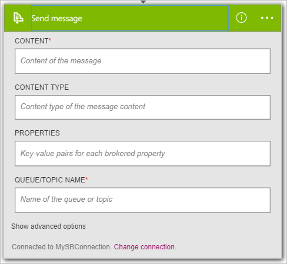

Agora que você adicionou um disparador, é hora de fazer algo interessante com os dados que são gerados pelo disparador. Siga estas etapas para adicionar a ação de **Barramento de serviço - enviar mensagem** . Esta ação envia uma mensagem para barramento de serviço.  

Siga estas etapas para criar a ação de mensagem de envio:  

1. Selecione **+ nova etapa** para adicionar a ação.  
- Selecione **Adicionar uma ação**. Isso abre uma caixa de pesquisa, onde você pode pesquisar qualquer ação você gostaria de fazer. Neste exemplo, as ações de barramento de serviço são de interesse.    
   
- Insira *barramento de serviço*.  
- Selecione **Barramento de serviço - enviar mensagem** como a ação a ser executada.  
    
- Insira o conteúdo da mensagem. Isso é necessário.  
- Insira o nome de fila ou tópico ao qual a mensagem será enviada. Isso também é necessário.   
- Forneça outros detalhes sobre a mensagem. Isso é opcional.     
    
- Salve as alterações ao seu fluxo de trabalho.   
     
