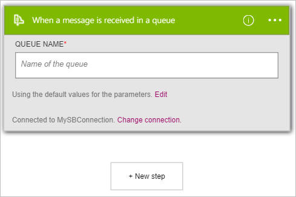

Veja aqui como usar o disparador **Barramento de serviço - quando uma mensagem for recebida em uma fila** para iniciar um fluxo de trabalho do aplicativo de lógica quando um novo item é enviado para uma fila de barramento de serviço.  

>[AZURE.NOTE]Você será solicitado a entrar com sua cadeia de caracteres de conexão do barramento de serviço se você ainda não tiver criado uma conexão para barramento de serviço.  

1. Na caixa de pesquisa no designer lógica aplicativos, insira **barramento de serviço**. Selecione o disparador **Barramento de serviço - quando uma mensagem for recebida em uma fila** .  
   
- A caixa de diálogo **quando uma mensagem for recebida em uma fila** é exibida.  
   
- Insira o nome da fila barramento de serviço que você gostaria que o disparador para monitorar.   
   

Neste ponto, seu aplicativo de lógica foi configurado com um disparador. Quando um novo item é recebido na fila selecionada, o disparador começará uma execução de outros disparadores e as ações no fluxo de trabalho.    
