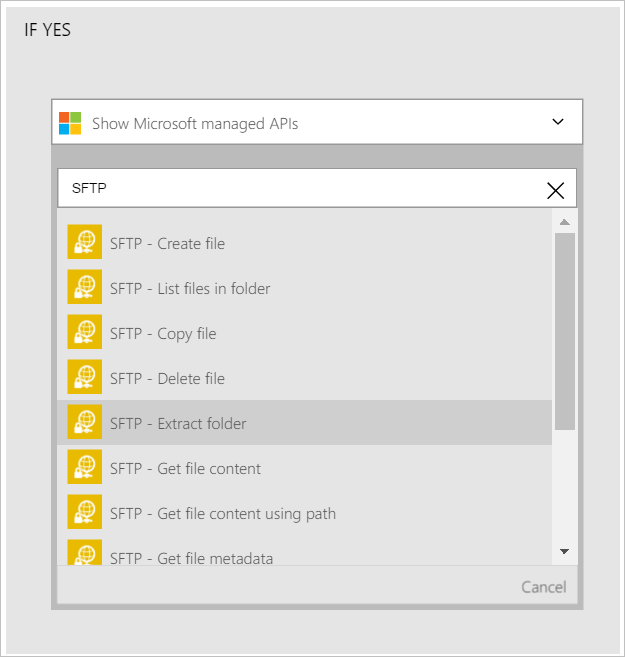

Agora que você adicionou um disparador, é hora de fazer algo interessante com os dados que são gerados pelo disparador. Siga estas etapas para adicionar uma a ação **SFTP - pasta extrair** . Esta ação irá extrair o conteúdo de um arquivo se as condições definidas forem atendidas. 

Para configurar esta ação, você precisará fornecer as seguintes informações. Você notará que é fácil de usar dados gerados pelo disparador como entrada para algumas das propriedades para o novo arquivo:

|SFTP - extrair propriedades de pasta|Descrição|
|---|---|
|Caminho do arquivo morto fonte|Este é o caminho para o arquivo sendo extraído. Você pode selecionar um dos tokens de uma ação anterior ou procurar o servidor SFTP para localizar o caminho do arquivo.|
|Caminho da pasta de destino|Este é o caminho onde os arquivos extraídos serão colocados. Você pode selecione um dos tokens de uma ação anterior como o caminho de destino ou procure o servidor SFTP e selecione um caminho.|
|Substituir?|Indica se um arquivo com o mesmo nome que o arquivo extraído for encontrado no caminho da pasta de destino, se o arquivo existente deve ser substituído ou não.|

Vamos começar a adicionar a ação para extrair os arquivos se a condição definida anteriormente é avaliada como *verdadeira*. 

1. Selecione **Adicionar uma ação**.        
   
- Selecione a ação de **SFTP - extrair pasta**      
   
- Selecione o **caminho do arquivo morto fonte**              
   
- Selecione o símbolo de **caminho do arquivo** . Isso indica que você usará o caminho do arquivo do arquivo que o disparador encontrado como o caminho de arquivo de arquivamento de origem.           
   
- Selecione o **caminho da pasta de destino**           
   
- Selecione o símbolo de **caminho do arquivo** . Isso indica que você usará o caminho do arquivo do arquivo que o disparador encontrado como o caminho de destino para os arquivos extraídos.   
- Insira *\ExtractedFile* no controle de **caminho de pasta de destino** . Faça isso logo após o token de caminho de arquivo no controle de caminho de pasta de destino.         
   
- Digite *verdadeiro* no **sobrescrever?* controle para indicar que os arquivos existentes devem ser substituídos se tiverem o mesmo nome como os arquivos extraídos.      
   
- Salvar as alterações ao seu fluxo de trabalho  
