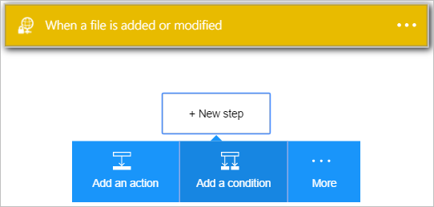
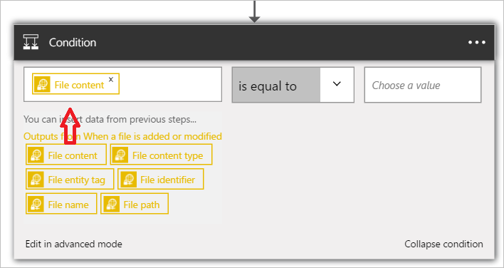

1. Selecione **+ nova etapa** para adicionar a ação.  
- Selecione o link **Adicionar uma ação** . Isso abre a caixa de pesquisa onde você pode pesquisar qualquer ação você gostaria de fazer. Neste exemplo, as ações do SharePoint são de interesse.    
    
- Selecione **Escolher um valor** à esquerda. 
    
- Selecione o **conteúdo do arquivo** para indicar que você deseja avaliar o conteúdo do arquivo na condição.      
   
- Selecione *contém* a lista de operadores.       
   
- Selecione **Escolher um valor** à direita e digite *ExtractMeFirst*. Neste exemplo, ExtractMeFirst é um valor que deve estar em um arquivo por pessoas que têm acesso à pasta SFTP para indicar que se trata de um arquivo que deve ser extraído.  
   