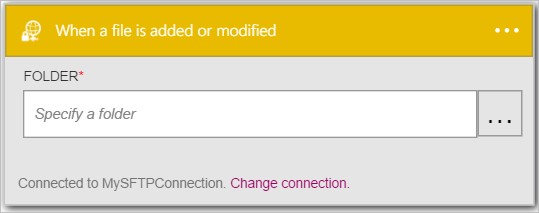
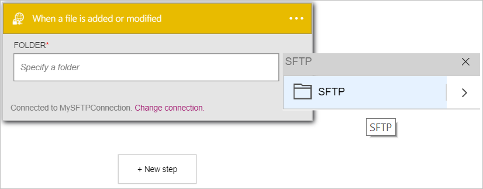
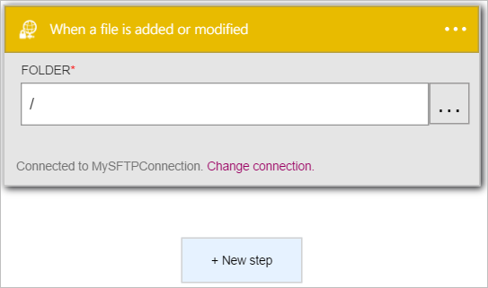

Vamos adicionar um disparador.

1. Insira *sftp* na caixa de pesquisa no designer de aplicativos de lógica e selecione o disparador **SFTP - quando um arquivo é adicionado ou modificado**   
  
- Abre o controle **quando um arquivo é adicionado ou modificado**  
  
- Selecione o **…** localizada no lado direito do controle. Isso abre o controle de selecionador de pasta  
  
- Selecione o **SFTP** para selecionar a pasta raiz da pasta para monitorar arquivos novos ou modificados. Observe que a pasta raiz agora é exibida no controle de **pasta** .  
   

Neste ponto, seu aplicativo de lógica foi configurado com um disparador que iniciará uma execução de outros disparadores e as ações no fluxo de trabalho quando um arquivo é modificado ou criado na pasta SFTP específico. 

>[AZURE.NOTE]Para um aplicativo de lógica esteja funcional, ele deve conter pelo menos um disparador e uma ação. Siga as etapas na próxima seção para adicionar uma ação.  