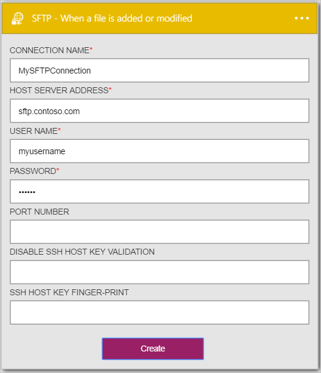

### Pré-requisitos

- Uma conta [SFTP](https://en.wikipedia.org/wiki/SSH_File_Transfer_Protocol)  

Antes de poder usar sua conta SFTP em um aplicativo de lógica, você deve autorizar o aplicativo de lógica para se conectar à sua conta SFTP. Felizmente, você pode fazer isso facilmente a partir de dentro de seu aplicativo de lógica no Portal do Azure.  

Aqui estão as etapas para autorizar seu aplicativo lógica para se conectar à sua conta SFTP:  
1. Para criar uma conexão para SFTP, no designer de aplicativo de lógica, selecione **Mostrar Microsoft APIs gerenciadas** na lista suspensa e digite *SFTP* na caixa de pesquisa. Selecione o disparador **SFTP - quando um arquivo é adicionado ou modificado** :  
  
2. Se você ainda não criou as conexões SFTP antes, você vai obter solicitado a fornecer suas credenciais SFTP. Essas credenciais serão usadas para autorizar seu aplicativo lógica para se conectar ao e acessam os dados da sua conta SFTP:  
  
3. Observe que a conexão tiver sido criado e agora você está livre para continuar com as outras etapas em seu aplicativo de lógica:   
  
