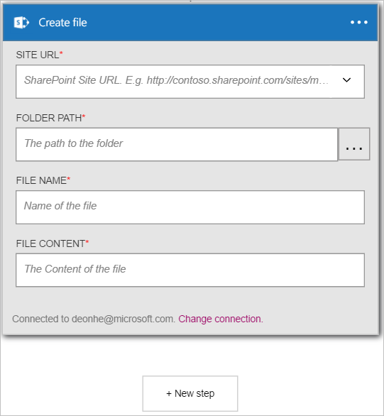
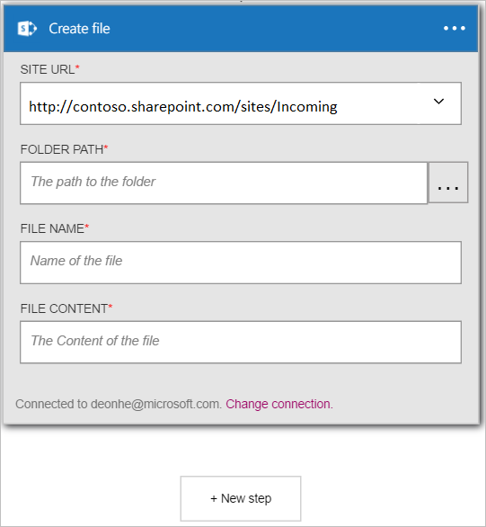
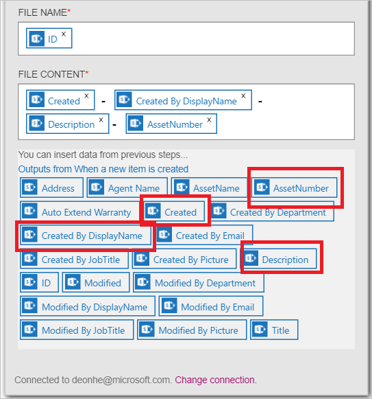

Agora que você adicionou um disparador, é hora de fazer algo interessante com os dados que são gerados pelo disparador. Siga estas etapas para adicionar a ação **Do SharePoint Online - criar arquivo** . Esta ação criará um arquivo no SharePoint Online sempre que aciona o novo disparador de item. 

Para configurar esta ação, você precisará fornecer as seguintes informações. Conforme você fornece essas informações, você notará que é fácil de usar dados gerados pelo disparador como entrada para algumas das propriedades para o novo arquivo:

|Criar propriedade de arquivo|Descrição|
|---|---|
|URL do site|Esta é a URL do site do SharePoint Online onde você deseja criar o novo arquivo. Selecione o site da lista apresentada.|
|Caminho da pasta|Esta é a pasta (na URL de Site selecionada na etapa anterior) onde o novo arquivo será colocado. Procure e selecione a pasta.|
|Nome do arquivo|Este é o nome do arquivo está sendo criado.|
|Conteúdo do arquivo|O conteúdo que será gravado para o arquivo.|

1. Selecione **+ nova etapa** para adicionar a ação.  
  
- Selecione o link **Adicionar uma ação** . Isso abre a caixa de pesquisa onde você pode pesquisar qualquer ação você gostaria de fazer. Neste exemplo, as ações do SharePoint são de interesse.    
    
- Insira o *sharepoint* para pesquisar ações relacionadas ao SharePoint.
- Selecione **SharePoint Online - criar arquivo** como a ação a ser executada.   **Observação**: você será solicitado a autorizar seu aplicativo de lógica para acessar sua conta do SharePoint se você não tiver criado uma conexão no SharePoint Online anteriormente.    
    
- O controle de **criar arquivo** abre.   
     
- Selecione a **URL do Site** e navegue para localizar o site onde você deseja criar o arquivo.     
  
- Selecione o **caminho da pasta** e procure a pasta onde o novo arquivo será colocado.  
  
- Selecione o controle de **nome de arquivo** e insira o nome do arquivo que você deseja criar. Aqui, você pode digitar o nome do arquivo diretamente ou você pode usar qualquer uma das propriedades do disparador criado anteriormente. Você pode fazer isso selecionando Propriedades da lista de **saídas de quando um novo item é criado**. Esta lista é somente exibição após selecionar o controle de **nome de arquivo** . Nessa explicação passo a passo, eu selecionado identificação (a identificação do item da lista novos) como o nome do arquivo sendo criado pela ação **Do SharePoint Online - criar arquivo** .    
  
- Selecione o controle de **conteúdo do arquivo** e insira o conteúdo que será gravado para o arquivo que será criado. Para ver o conteúdo do arquivo, observe que você pode usar qualquer uma das propriedades do disparador criado anteriormente. Basta selecione as propriedades da lista apresentada. Como alternativa, você pode inserir o **conteúdo do arquivo** de texto diretamente no controle. Neste exemplo, eu algumas propriedades selecionadas e adicionado espaços e um hífen entre cada propriedade.        
  
- Salvar as alterações ao seu fluxo de trabalho  
- Parabéns, agora você tem um aplicativo de lógica totalmente funcional que é disparado quando um novo item é adicionado a uma lista do SharePoint Online. O aplicativo irá criar um arquivo, usando algumas das propriedades do novo item da lista.  Agora você pode testá-lo, criando um novo item na lista do SharePoint. 
