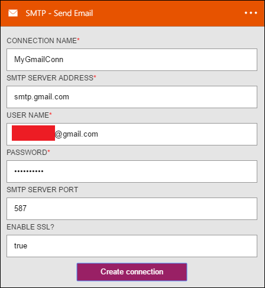

### Pré-requisitos

- Uma conta de [SMTP](https://wikipedia.org/wiki/Simple_Mail_Transfer_Protocol)  

Antes de poder usar sua conta de SMTP em um aplicativo de lógica, você deve autorizar o aplicativo de lógica para se conectar à sua conta de SMTP. Felizmente, você pode fazer isso facilmente a partir de dentro de seu aplicativo de lógica no Portal do Azure.  

Aqui estão as etapas para autorizar seu aplicativo de lógica para se conectar à sua conta de SMTP:  
1. Para criar uma conexão para SMTP, no designer de aplicativo de lógica, selecione **Mostrar Microsoft APIs gerenciadas** na lista suspensa e digite *SMTP* na caixa de pesquisa. Selecione o disparador ou a ação que você gostará usar:  
  
2. Se você ainda não criou as conexões SMTP antes, você vai obter solicitado a fornecer suas credenciais de SMTP. Essas credenciais serão usadas para autorizar seu aplicativo lógica para se conectar ao e acessam os dados da sua conta de SMTP:  
  
3. Observe que a conexão tiver sido criado e agora você está livre para continuar com as outras etapas em seu aplicativo de lógica:  
   

