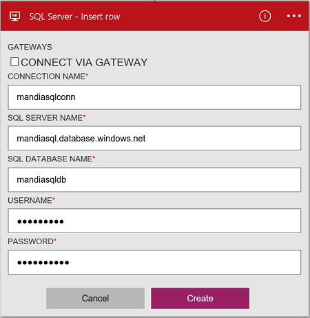

### Pré-requisitos
- Uma conta do Azure; Você pode criar uma [conta gratuita](https://azure.microsoft.com/free)
- Um [Banco de dados do SQL Azure](../articles/sql-database/sql-database-get-started.md) com suas informações de conexão, incluindo o nome do servidor, nome do banco de dados e nome de usuário/senha. Essas informações estão incluídas na cadeia de conexão de banco de dados SQL:
  
    Servidor = tcp:*yoursqlservername*. database.windows.net,1433;Initial catálogo =*yourqldbname*; Manter as informações de segurança = False; ID de usuário = {your_username}; Senha = {your_password}; Para MultipleActiveResultSets = False; Criptografar = verdadeiro; TrustServerCertificate = False; Tempo limite de Conexão = 30;

    Leia mais sobre [Bancos de dados do SQL Azure](https://azure.microsoft.com/services/sql-database).

> [AZURE.NOTE] Quando você cria um banco de dados do SQL Azure, você também pode criar os bancos de dados de exemplo incluídos com o SQL. 

Antes de usar o banco de dados do SQL Azure em um aplicativo de lógica, se conecte ao seu banco de dados do SQL. Você pode fazer isso facilmente dentro de seu aplicativo de lógica no portal do Azure.  

Conecte ao seu banco de dados de SQL Azure usando as seguintes etapas:  

1. Crie um aplicativo de lógica. No criador de aplicativos de lógica, adicionar um disparador e adicione uma ação. Selecione **Mostrar Microsoft APIs gerenciadas** na lista suspensa e, em seguida, insira "sql" na caixa de pesquisa. Selecione uma das ações:  

    

2. Se você ainda não criou anteriormente todas as conexões ao banco de dados do SQL, você será solicitado para os detalhes de conexão:  

     

3. Insira os detalhes de banco de dados SQL. Propriedades com um asterisco são necessárias.

    | Propriedade | Detalhes |
|---|---|
| Conectar-se por meio de Gateway | Deixe desmarcada. Isso é usado ao se conectar a um SQL Server local. |
| Nome de Conexão * | Insira um nome para sua conexão. | 
| Nome do SQL Server * | Insira o nome do servidor; qual é algo parecido com *servername.database.windows.net*. O nome do servidor é exibido nas propriedades de banco de dados SQL no portal do Azure e também é exibido na cadeia de conexão. | 
| Nome do banco de dados SQL * | Insira o nome que você deu seu banco de dados do SQL. Isso está listado nas propriedades de banco de dados SQL na cadeia de conexão: catálogo inicial =*yoursqldbname*. | 
| Nome de usuário * | Insira o nome de usuário que é criada quando o banco de dados do SQL foi criado. Isso é listado nas propriedades de banco de dados SQL no portal do Azure. | 
| Senha * | Insira a senha criada quando o banco de dados do SQL foi criado. | 

    Essas credenciais são usadas para autorizar seu aplicativo de lógica para conectar-se e acessar seus dados do SQL. Após a conclusão, os detalhes da conexão aparência semelhantes à seguinte:  

     

4. Selecione **criar**. 

5. Observe que a conexão tiver sido criado. Agora, continue com as outras etapas em seu aplicativo de lógica: 

    