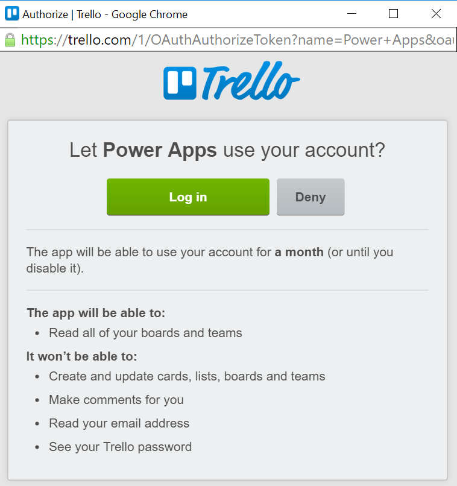

### Pré-requisitos
- Uma conta de [Trello](http://trello.com) 

Antes de poder usar sua conta de Trello em um aplicativo de lógica, você deve autorizar o aplicativo de lógica para se conectar à sua conta de Trello. Felizmente, você pode fazer isso facilmente a partir de dentro de seu aplicativo de lógica no Portal do Azure. 

Aqui estão as etapas para autorizar seu aplicativo de lógica para se conectar à sua conta de Trello:

1. Para criar uma conexão para Trello, no designer de aplicativo de lógica, selecione **Mostrar Microsoft APIs gerenciadas** na lista suspensa e digite *Trello* na caixa de pesquisa. Selecione o disparador ou a ação que você gostará usar:  
  
2. Se você ainda não criou as conexões Trello antes, você vai obter solicitado a fornecer suas credenciais de Trello. Essas credenciais serão usadas para autorizar seu aplicativo de lógica para se conectar ao e acessam os dados da sua conta de Trello:  
   
3. Permitir conosco para se conectar ao Trello:  
     
4. Forneça seu Trello nome de usuário e senha para autorizar seu aplicativo de lógica:  
    
5. Observe que a conexão tiver sido criado e agora você está livre para continuar com as outras etapas em seu aplicativo de lógica:  
  
