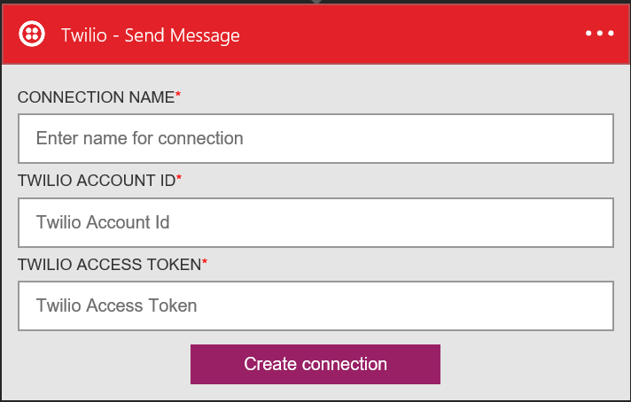

### Pré-requisitos
- Uma conta de Twilio
- Um número de telefone Twilio verificado que possa receber SMS
- Um número de telefone Twilio verificado que possa enviar SMS

>[AZURE.NOTE] Se você estiver usando uma conta de avaliação Twilio, para enviar SMS para números de telefone **verificado** .  

Antes de poder usar sua conta de Twilio em um aplicativo de lógica, você deve autorizar o aplicativo de lógica para se conectar à sua conta de Twilio. Felizmente, você pode fazer isso facilmente a partir de dentro de seu aplicativo de lógica no Portal do Azure. 

Aqui estão as etapas para autorizar seu aplicativo de lógica para se conectar à sua conta de Twilio:

1. Para criar uma conexão para Twilio, no designer de aplicativo de lógica, selecione **Mostrar Microsoft APIs gerenciadas** na lista suspensa e digite *Twilio* na caixa de pesquisa. Selecione o disparador ou a ação que você gostará usar:  
  
2. Se você ainda não criou as conexões Twilio antes, você vai obter solicitado a fornecer suas credenciais de Twilio. Essas credenciais serão usadas para autorizar seu aplicativo de lógica para se conectar ao e acessam os dados da sua conta de Twilio:  
    
3. Você precisará a **id da conta de Twilio** e o **token de acesso de Twilio** no painel do Twilio, então faça logon sua conta de Twilio agora para atrair essas duas partes de informações:  
    
4. Aplicativos Twilio e lógica usam nomes diferentes para identificar essas duas partes de informações. Aqui está como você deve mapeá-los para a caixa de diálogo de aplicativos de lógica:  
5. Selecione o botão **Criar conexão** :  
  
6. Observe que a conexão tiver sido criado e agora você está livre para continuar com as outras etapas em seu aplicativo de lógica:  
  