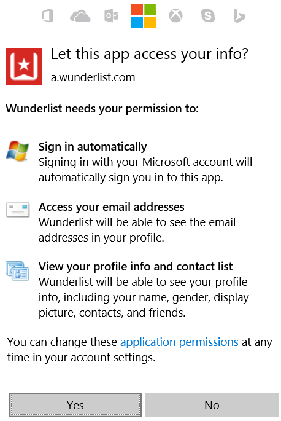
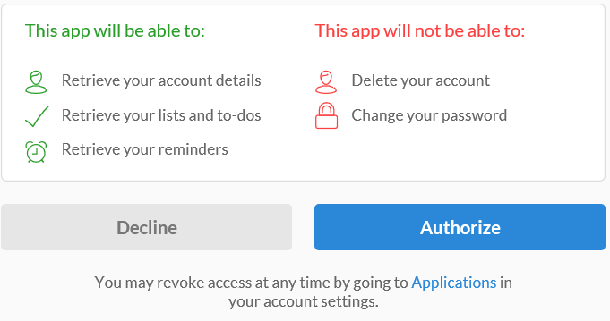

### Pré-requisitos
- Uma conta de Wunderlist  

Antes de poder usar sua conta de Wunderlist em um aplicativo de lógica, você deve autorizar o aplicativo de lógica para se conectar à sua conta de Wunderlist. Felizmente, você pode fazer isso facilmente a partir de dentro de seu aplicativo de lógica no Portal do Azure. 

Aqui estão as etapas para autorizar seu aplicativo de lógica para se conectar à sua conta de Wunderlist:

1. Para criar uma conexão para Wunderlist, no designer de aplicativo de lógica, selecione **Mostrar Microsoft APIs gerenciadas** na lista suspensa e digite *Wunderlist* na caixa de pesquisa. Selecione o disparador ou a ação que você gostará usar:  
  
2. Se você ainda não criou as conexões Wunderlist antes, você vai obter solicitado a fornecer suas credenciais de Wunderlist. Essas credenciais serão usadas para autorizar seu aplicativo de lógica para se conectar ao e acessam os dados da sua conta de Wunderlist:   
    
2. Fornecer suas credenciais e em seguida, selecione o botão entrar  
    
3. Em seguida, você vai ser informado o que o aplicativo de lógica terão permissões fazer com sua conta de Wunderlist. Se você concordar, selecione o botão para indicar o contrato. 
    
4. Por fim, selecione o botão **Autorizar**  
    

