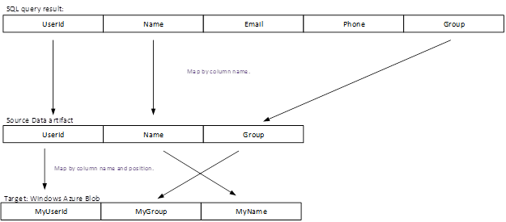

## Mapeamento de coluna com regras de tradutor
Mapeamento de coluna pode ser usado para especificar como colunas especificadas na estrutura de"" do mapa de tabela de origem para colunas especificado na tabela de receptor "estrutura". A propriedade **columnMapping** está disponível na seção **typeProperties** da atividade de cópia.

Mapeamento de coluna oferece suporte para os seguintes cenários:

- Todas as colunas na tabela de origem "estrutura" são mapeadas para todas as colunas na tabela receptor "estrutura".
- Um subconjunto das colunas na tabela de origem "estrutura" são mapeados para todas as colunas na tabela receptor "estrutura".

A seguir é condições de erro e resultará em uma exceção:

- Menos colunas ou mais colunas na estrutura de"" da tabela de receptor que especificadas no mapeamento.
- Mapeamento de duplicados.
- Resultado da consulta SQL não tem um nome de coluna especificado no mapeamento.

## Exemplos de mapeamento de coluna
> [AZURE.NOTE] Os exemplos abaixo são para SQL Azure e o Azure Blob, mas são aplicáveis a qualquer armazenamento de dados que ofereça suporte a conjuntos de dados retangulares. Você precisará ajustar dataset e definições de serviço vinculada nos exemplos abaixo para apontar para dados na fonte de dados relevantes. 

### Exemplo 1 – coluna mapeamento do SQL Azure ao Azure blob
Neste exemplo, a tabela de entrada tem uma estrutura e ele aponta para uma tabela do SQL em um banco de dados do SQL Azure.

    {
        "name": "AzureSQLInput",
        "properties": {
            "structure": 
             [
               { "name": "userid"},
               { "name": "name"},
               { "name": "group"}
             ],
            "type": "AzureSqlTable",
            "linkedServiceName": "AzureSqlLinkedService",
            "typeProperties": {
                "tableName": "MyTable"
            },
            "availability": {
                "frequency": "Hour",
                "interval": 1
            },
            "external": true,
            "policy": {
                "externalData": {
                    "retryInterval": "00:01:00",
                    "retryTimeout": "00:10:00",
                    "maximumRetry": 3
                }
            }
        }
    }

Neste exemplo, a tabela de saída tem uma estrutura e ela aponta para um blob em um armazenamento de blob do Microsoft Azure.

    {
        "name": "AzureBlobOutput",
        "properties":
        {
             "structure": 
              [
                    { "name": "myuserid"},
                    { "name": "myname" },
                    { "name": "mygroup"}
              ],
            "type": "AzureBlob",
            "linkedServiceName": "StorageLinkedService",
            "typeProperties": {
                "folderPath": "mycontainer/myfolder",
                "fileName":"myfile.csv",
                "format":
                {
                    "type": "TextFormat",
                    "columnDelimiter": ","
                }
            },
            "availability":
            {
                "frequency": "Hour",
                "interval": 1
            }
        }
    }

O JSON para a atividade é mostrado abaixo. As colunas de origem mapeados para colunas em receptor (**columnMappings**) usando **tradutor** propriedade.

    {
        "name": "CopyActivity",
        "description": "description", 
        "type": "Copy",
        "inputs":  [ { "name": "AzureSQLInput"  } ],
        "outputs":  [ { "name": "AzureBlobOutput" } ],
        "typeProperties":    {
            "source":
            {
                "type": "SqlSource"
            },
            "sink":
            {
                "type": "BlobSink"
            },
            "translator": 
            {
                "type": "TabularTranslator",
                "ColumnMappings": "UserId: MyUserId, Group: MyGroup, Name: MyName"
            }
        },
       "scheduler": {
              "frequency": "Hour",
              "interval": 1
            }
    }

**Fluxo de mapeamento de coluna:**

### Exemplo 2 – coluna mapeamento com a consulta SQL do SQL Azure blob do Microsoft Azure
Neste exemplo, uma consulta SQL é usada para extrair dados do SQL Azure em vez de simplesmente especificando o nome da tabela e nomes de coluna na seção "estrutura". 

    {
        "name": "CopyActivity",
        "description": "description", 
        "type": "CopyActivity",
        "inputs":  [ { "name": " AzureSQLInput"  } ],
        "outputs":  [ { "name": " AzureBlobOutput" } ],
        "typeProperties":
        {
            "source":
            {
                "type": "SqlSource",
                "SqlReaderQuery": "$$Text.Format('SELECT * FROM MyTable WHERE StartDateTime = \\'{0:yyyyMMdd-HH}\\'', WindowStart)"
            },
            "sink":
            {
                "type": "BlobSink"
            },
            "Translator": 
            {
                "type": "TabularTranslator",
                "ColumnMappings": "UserId: MyUserId, Group: MyGroup,Name: MyName"
            }
        },
        "scheduler": {
              "frequency": "Hour",
              "interval": 1
            }
    }

Nesse caso, os resultados da consulta primeiro são mapeados para colunas especificadas nas "estrutura" da fonte. Em seguida, as colunas de origem "estrutura" são mapeadas para colunas em receptor "estrutura" com regras especificadas em columnMappings.  Digamos que a consulta retorna 5 colunas, duas colunas adicionais depois aquelas especificadas na estrutura de"" da fonte.

**Fluxo de mapeamento de coluna**

