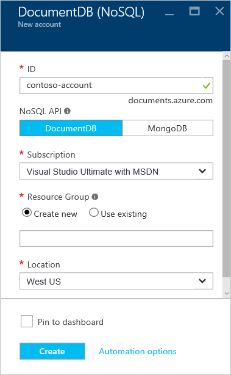

1.  Entrar no [portal do Azure](https://portal.azure.com/).
2.  No Jumpbar, clique em **novo**, clique em **dados + armazenamento**e clique em **DocumentDB (NoSQL)**.

      

3. Na **nova conta** lâmina, especifique as configurações desejadas para a conta de DocumentDB.

    

    - Na caixa **ID** , insira um nome para identificar a conta de DocumentDB.  Quando a **identificação** é validada, uma marca de seleção verde aparece na caixa **ID** . O valor de **ID** se torna o nome de host dentro o URI. A **ID** pode conter apenas letras minúsculas, números e a '-' caracteres e deve estar entre 3 e 50 caracteres. Observe que *documents.azure.com* é acrescentado ao nome do ponto de extremidade que você escolher, o resultado do qual se torna seu ponto de extremidade de conta de DocumentDB.

    - Na caixa **NoSQL API** , selecione **DocumentDB**.  

    - Para **assinatura**, selecione a assinatura Azure que você deseja usar para a conta de DocumentDB. Se a sua conta tiver apenas uma assinatura, essa conta é selecionada por padrão.

    - No **Grupo de recursos**, selecione ou crie um grupo de recursos para a sua conta de DocumentDB.  Por padrão, um novo grupo de recursos é criado. Para obter mais informações, consulte [usando o portal do Azure para gerenciar seus recursos Azure](../articles/azure-portal/resource-group-portal.md).

    - Use o **local** para especificar a localização geográfica na qual hospedar sua conta de DocumentDB. 

4.  Quando as novas opções de conta de DocumentDB estão configuradas, clique em **criar**. Para verificar o status da implantação, confira o hub de notificações.  

      

    

5.  Após a conta DocumentDB é criada, está pronto para uso com as configurações padrão. A consistência padrão da conta de DocumentDB está definida para **sessão**.  Você pode ajustar a consistência padrão clicando em **Consistência padrão** no menu do recurso. Para saber mais sobre os níveis de consistência oferecidos por DocumentDB, consulte [níveis de consistência em DocumentDB](../articles/documentdb/documentdb-consistency-levels.md).

      

      

[How to: Create a DocumentDB account]: #Howto
[Next steps]: #NextSteps
[documentdb-manage]:../articles/documentdb/documentdb-manage.md
