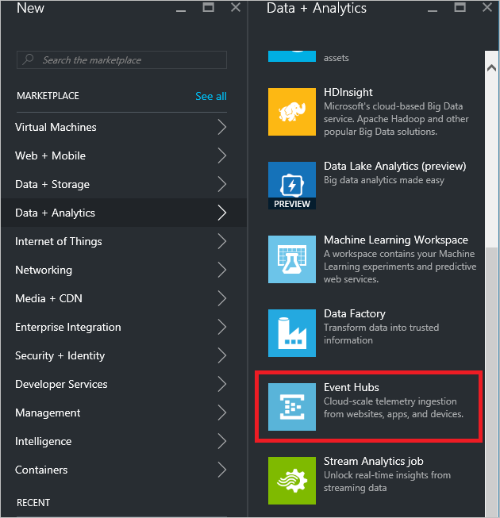
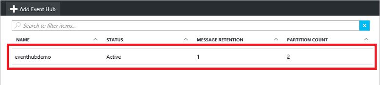
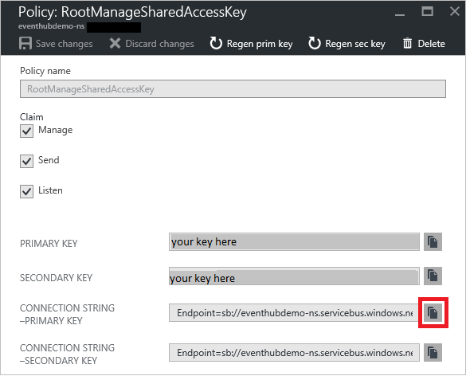

## Criar um Hub de evento

1. Faça logon no [portal do Azure][]e clique em **novo** na parte superior esquerda da tela.

2. Clique em **dados + análise**, clique em **Hubs de evento**.

    

3. Na lâmina **criar namespace** , insira um nome de namespace. O sistema imediatamente verifica se o nome está disponível.

    

4. Depois de garantir que o nome do namespace estiver disponível, escolha o nível de preços (Basic ou padrão). Além disso, escolha uma assinatura do Azure, grupo de recursos e local criar o recurso. 

2. Clique em **criar** para criar o espaço para nome.

6. Na lista de namespace Hubs de evento, clique em namespace recém-criado.      

    

7. Na lâmina namespace, clique em **Hubs de evento**.

    

8. Na parte superior da lâmina, clique em **Adicionar Hub de evento**.

    

3. Digite um nome para seu Hub de evento e, em seguida, clique em **criar**.

    

4. Na lista de Hubs de evento, clique no nome de Hub de evento recém-criado. 

    

5. Novamente na lâmina namespace (não a lâmina Hub de evento específico), clique em **políticas de acesso compartilhado**e clique em **RootManageSharedAccessKey**.

    

5. Clique no botão Copiar para copiar a cadeia de conexão **RootManageSharedAccessKey** para a área de transferência. Salve essa cadeia de caracteres de conexão para usar posteriormente no tutorial.

    

Seu Hub de evento agora é criado, e você tiver as cadeias de caracteres de conexão que você precisa enviar e receber eventos.

[Portal do Azure]: https://portal.azure.com/