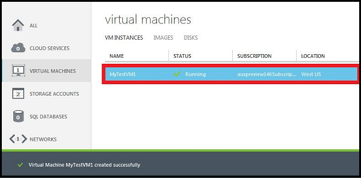

#Como criar uma máquina Virtual personalizada

Uma máquina virtual *personalizada* se refere a uma máquina virtual que você cria usando o método **De galeria** porque ele permite que você configure mais opções do que o método de **Criação rápida** . Essas opções incluem:

- Mais opções de imagem a ser usada para criar a máquina virtual (VM)
- Conectando a máquina virtual a uma rede virtual
- Adicionando a máquina virtual a um serviço de nuvem existente
- Adicionando a máquina virtual a um conjunto de disponibilidade

> [AZURE.IMPORTANT] Se quiser que sua máquina virtual para usar uma rede virtual para que você possa se conectar a ele diretamente por nome do host ou configurar conexões entre locais, verifique se que você especificar a rede virtual quando você cria a máquina virtual. Uma máquina virtual pode ser configurada para ingressar em uma rede virtual somente quando você cria a máquina virtual. Para obter mais informações sobre redes virtuais, consulte [Visão geral de rede Virtual do Azure](http://go.microsoft.com/fwlink/p/?LinkID=294063).

1. Entrar no [portal do Azure](http://manage.windowsazure.com).

2. Na barra de comandos, clique em **novo**.

3. Clique em **Calcular**, clique em **Máquina Virtual**e, em seguida, clique em **Galeria de**.

4. Escolha a imagem que você deseja usar e clique na seta para continuar.

5. Se várias versões da imagem estão disponíveis, data de **lançamento**de versão, escolha a versão que você deseja usar.

6. Em **Nome de máquina Virtual**, digite o nome que você deseja usar para a máquina virtual.

7. Use **camadas** e **o tamanho** para selecionar o tamanho apropriado para a máquina virtual. O tamanho que você seleciona afeta a configuração máxima de máquina virtual, bem como os preços. Para obter detalhes de configuração, consulte [Máquina Virtual e tamanhos de serviço de nuvem do Azure](http://go.microsoft.com/fwlink/p/?LinkID=389844).

8. No **Novo nome de usuário**, digite um nome para a conta administrativa que você deseja usar para gerenciar o servidor.

9. Em **Nova senha**, digite uma senha forte para a conta administrativa. Em **Confirmar senha**, digite novamente a mesma senha.

10. Clique na seta para continuar.

11. No **Serviço de nuvem**, siga um destes procedimentos:

    - Se esta for a máquina virtual primeira ou apenas no serviço de nuvem, selecione **criar um novo serviço de nuvem**. Em seguida, em **Nome de DNS de serviço de nuvem**, digite um nome que usa entre 3 e 24 letras minúsculas e números. Esse nome torna-se parte do URI que é usado para contatar a máquina virtual por meio do serviço de nuvem.
    - Se esta máquina virtual está sendo adicionada a um serviço de nuvem, selecione-o na lista.

    > [AZURE.NOTE] Para obter mais informações sobre onde colocar máquinas virtuais no serviço de nuvem mesmo, consulte [como conectar máquinas virtuais em um serviço na nuvem](https://azure.microsoft.com/manage/windows/how-to-guides/connect-to-a-cloud-service/).

12. Na **Rede de grupo/Virtual de região/afinidade**, selecione região, grupo de afinidade ou rede virtual que você deseja usar para a máquina virtual. Para obter mais informações sobre os grupos de afinidade, consulte [sobre grupos de afinidade para rede Virtual](../virtual-network/virtual-networks-migrate-to-regional-vnet.md).

13. Na **Conta de armazenamento**, selecione uma conta de armazenamento existente para o arquivo VHD ou usar uma conta de armazenamento gerado automaticamente. Apenas uma conta de armazenamento por região será criada automaticamente. Todas as outras máquinas virtuais criadas com essa configuração estão localizadas nesta conta de armazenamento. Você está limitado a 20 contas de armazenamento.

14. Se quiser que a máquina virtual deve pertencer a um conjunto de disponibilidade, na **Disponibilidade definida**, selecione **criar disponibilidade definida** ou adicioná-la a um conjunto de disponibilidade existente.

    **Observação**: máquinas virtuais em um conjunto de disponibilidade são implantados em domínios de falha diferente. Colocando várias máquinas virtuais em uma disponibilidade conjunto ajuda a garantir que seu aplicativo esteja disponível durante falhas de rede, falhas de hardware de disco local e qualquer tempo de inatividade planejado.

15.  Em **pontos de extremidade**, examine os pontos de extremidade novo que serão criados para permitir conexões a máquina virtual, por exemplo, por meio de área de trabalho remota ou um cliente SSH (Secure Shell). Você também pode adicionar pontos de extremidade agora ou criá-las mais tarde. Para obter instruções sobre como criá-las mais tarde, consulte [como configurar o pontos de extremidade para uma máquina Virtual](../articles/virtual-machines/virtual-machines-windows-classic-setup-endpoints.md).

16.  Em **Agente de máquina virtual**, decida se deseja instalar o agente de máquina virtual. Este agente fornece o ambiente para você instalar extensões que podem ajudar a interagir com o computador virtual. Para obter detalhes, consulte [Gerenciar extensões](http://go.microsoft.com/FWLink/p/?LinkID=390493).

17. Clique na seta para criar a máquina virtual.

    

##Próximas etapas##
Após a máquina virtual for criada, ele é iniciado automaticamente. Quando o portal mostra o status como em execução, você pode efetuar login na máquina virtual. Para obter instruções, consulte um dos seguintes artigos:

- [Como fazer logon em uma máquina Virtual executando Linux](../articles/virtual-machines/virtual-machines-linux-mac-create-ssh-keys.md)
- [Como fazer logon em uma máquina Virtual executando o Windows Server](../articles/virtual-machines/virtual-machines-windows-classic-connect-logon.md)

