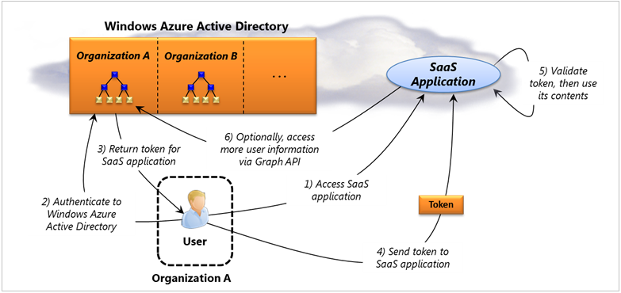

Gerenciando identidade é tão importante na nuvem pública como está no local. Para ajudar com isso, o Azure oferece suporte a várias tecnologias de identidade de nuvem diferentes. Eles incluem:

- Você pode executar o Windows Server Active Directory (normalmente chamado apenas AD) na nuvem usando máquinas virtuais criadas com máquinas virtuais do Azure. Essa abordagem faz sentido quando você estiver usando o Azure para estender seu centro de dados local para a nuvem.

- Você pode usar o Active Directory do Azure para dar a seu usuários logon único para aplicativos de [Software como um serviço (SaaS)](https://azure.microsoft.com/overview/what-is-saas/) . Por exemplo, Office 365 do Microsoft utiliza essa tecnologia, e aplicativos em execução no Azure ou outras plataformas na nuvem também podem usá-lo.

- Aplicativos em execução na nuvem ou local podem usar o controle de acesso do Azure Active Directory permitem que os usuários log usando identidades do Facebook, Google, Microsoft e de outros provedores de identidade.

Este artigo descreve todos os três dessas opções.

## Sumário

- [Executando o Active Directory do Windows Server em máquinas virtuais](#adinvm)

- [Usando o Active Directory do Azure](#ad)

- [Usando o controle de acesso do Active Directory do Azure](#ac)

## Executando o Active Directory do Windows Server em máquinas virtuais

Executando o Windows Server AD em Azure máquinas virtuais é muito parecido executá-lo no local. [Figura 1](#fig1) mostra um exemplo típico de como isso é a aparência.

Figura 1: Active Directory do Windows Server pode executar no Azure máquinas virtuais conectadas ao data center de locais de uma organização usando rede Virtual do Azure.

No exemplo mostrado aqui, Windows Server AD é executado em VMs criadas usando máquinas virtuais do Azure, a tecnologia de IaaS da plataforma. Essas VMs e alguns outros são agrupados em uma rede virtual conectada a um centro de dados local usando rede Virtual do Azure. A rede virtual Entalha check-out de um grupo de máquinas virtuais de nuvem que interagem com a rede local por meio de uma conexão de rede virtual privada (VPN). Fazendo permite que essas máquinas virtuais Azure aparência apenas outra sub-rede ao data center local. Conforme mostrado na figura, dois dessas VMs estão executando controladores de domínio do Windows Server AD. As outras máquinas virtuais na rede virtual podem estar executando aplicativos, como o SharePoint ou sendo usada em alguma outra maneira, como para desenvolvimento e teste. Data Center local também está executando dois controladores de domínio do Windows Server AD.

Há várias opções para se conectar os controladores de domínio na nuvem com aqueles em execução no local:

- Tornar todos eles parte de um único domínio do Active Directory.

- Criar separada AD domínios locais e na nuvem que fazem parte da mesma floresta.

- Criar florestas AD separadas na nuvem e local e conecte as florestas usando relações de confiança entre floresta ou o Windows Server Active Directory Federation Services (AD FS), que também podem ser executados em máquinas virtuais no Azure.

Qualquer opção feita, um administrador deve garantir que solicitações de autenticação de usuários locais acessem nuvem controladores de domínio somente quando necessário, como o link para a nuvem é provavelmente será mais lento que redes locais. Outro fator a considerar na conexão de nuvem e controladores de domínio local é o tráfego gerado pela replicação. Controladores de domínio na nuvem são normalmente em seu próprio site AD, que permite que um administrador agendar frequência replicação é feita. Encargos Azure para o tráfego enviado fora de um data center Azure, embora não para bytes enviados em, que pode afetar as opções de replicação do administrador. Também vale a pena destacar que enquanto Azure fornecer seu próprio suporte de sistema de nome de domínio (DNS), esse serviço está faltando recursos exigidos pelo Active Directory (como suporte para registros de DNS dinâmico e SRV). Por isso, executando o Windows Server AD no Azure requer configurar seus próprios servidores DNS na nuvem.

Executando o Windows Server AD em VMs Azure pode fazer sentido em várias situações diferentes. Aqui estão alguns exemplos:

- Se você estiver usando máquinas virtuais do Azure como uma extensão de seu próprio data center, você pode executar aplicativos na nuvem que precisam de controladores de domínio locais para lidar com coisas como as solicitações de autenticação integrada do Windows ou consultas LDAP. SharePoint, por exemplo, interage com frequência com o Active Directory, e então Embora seja possível executar um farm do SharePoint no Azure usando um diretório local, configurando controladores de domínio na nuvem significativamente melhorará o desempenho. (É importante perceber que isso não é necessariamente necessário, no entanto; bastante de aplicativos podem ser executados com êxito na nuvem usando somente controladores de domínio local).

- Suponha que uma filial longínqua não possui os recursos para executar seus próprios controladores de domínio. Hoje, seus usuários devem ser autenticados controladores de domínio no outro lado do mundo - logon está lenta. Executando o Active Directory no Azure em um data detalhado Center a Microsoft pode acelerar isso sem exigir mais servidores na filial.

- Uma organização que usa o Azure para recuperação de dados pode manter um conjunto pequeno de ativos VMs na nuvem, incluindo um controlador de domínio. Em seguida, podem ser preparado para expandir este site conforme necessário para assumir para falhas em outro lugar.

Também existem outras possibilidades. Por exemplo, você não é necessária para conectar-se o Windows Server AD na nuvem para um data center local. Se você quiser executar um farm do SharePoint que serviram um determinado conjunto de usuários, por exemplo, todas quem seriam login exclusivamente com identidades baseado em nuvem, você pode criar uma floresta autônomo no Azure. Como usar essa tecnologia depende de quais são suas metas. (Para mais orientações detalhadas sobre como usar o Windows Server AD com o Azure, [Veja aqui](http://msdn.microsoft.com/library/windowsazure/jj156090.aspx).)

## Usando o Active Directory do Azure

Como aplicativos SaaS se tornam mais comuns, eles geram uma pergunta óbvia: que tipo de serviço de diretório esses aplicativos baseado em nuvem devem usar? Resposta da Microsoft para essa pergunta é Azure Active Directory.

Há duas opções principais para usar esse serviço de diretório na nuvem:

- Indivíduos e organizações que usam somente aplicativos SaaS podem depender Azure Active Directory como seu serviço de diretório exclusiva.

- Organizações que executam o Windows Server Active Directory podem conectar seu diretório local ao Azure Active Directory e usá-lo para dar seu usuários logon único aos aplicativos SaaS.

[Figura 2](#fig2) ilustra a primeira dessas duas opções, onde o Azure Active Directory é tudo que é necessário.

Figura 2: Active Directory do Azure fornece logon único de usuários da organização a SaaS aplicativos, incluindo o Office 365.

Conforme mostrado na figura, o Azure AD é um serviço de vários locatário. Isso significa que ele pode aceitar simultaneamente diferentes organizações, armazenar informações de diretório sobre usuários em cada um deles. Neste exemplo, um usuário em uma organização está tentando acessar um aplicativo de SaaS. Este aplicativo pode ser parte do Office 365, como o SharePoint Online, ou pode ser algo mais - aplicativos não-Microsoft também podem usar essa tecnologia. Como Azure AD suporta o protocolo de SAML 2.0, tudo que é necessário de um aplicativo é a capacidade de interagir usando este padrão da indústria. (Na verdade, aplicativos que usam o Azure AD podem ser executados em qualquer data center, não apenas um data center Azure.)

O processo começa quando o usuário acessa um aplicativo de SaaS (etapa 1). Para usar este aplicativo, o usuário deve apresentar um token emitido por Azure AD.

Esse token contém informações que identifica o usuário, e ele é assinado digitalmente por Azure AD. Para obter o token, o usuário autentica si Azure AD, fornecendo um nome de usuário e senha (etapa 2). Azure AD, em seguida, retorna o token ele precisa (etapa 3).

Esse token é enviada ao aplicativo SaaS (etapa 4), que valida assinatura do token e usa seu conteúdo (etapa 5). Normalmente, o aplicativo usará as informações de identidade que o token contém para decidir quais informações que o usuário tem permissão para acessar e talvez de outras maneiras.

Se o aplicativo precisar de mais informações sobre o usuário que o que está contido no token, ele pode solicitar isso diretamente do Azure AD usando a API do Azure AD Graph (etapa 6). Na versão inicial do Azure AD, o esquema de diretório é bastante simple: ele contém apenas usuários e grupos e relações entre elas. Aplicativos podem usar essas informações para saber mais sobre conexões entre os usuários. Por exemplo, suponha que um aplicativo precisa saber quem é o gerente desse usuário decidir se ele tiver permissão de acesso para alguns fragmento de dados. Ele pode aprender isso consultando Azure AD por meio da API do gráfico.

A API do gráfico usa um protocolo RESTful comum, que torna mais simples de usar a maioria dos clientes, incluindo os dispositivos móveis. A API também suporta as extensões definidas pelo OData, adicionando itens como uma linguagem de consulta para permitir que os clientes acessar dados de maneiras mais úteis. (Para saber mais sobre OData, consulte [Introdução ao OData](http://download.microsoft.com/download/E/5/A/E5A59052-EE48-4D64-897B-5F7C608165B8/IntroducingOData.pdf).) Como a API do gráfico podem ser usada para saber mais sobre relações entre usuários, ele permite que aplicativos entender o graph social incorporada no esquema do Azure AD para uma determinada organização (que é o motivo pelo qual ele chamou a API de gráfico). E para autenticar ao Azure AD para solicitações de API de gráfico, um aplicativo usa OAuth 2.0.

Se uma organização não usar o Active Directory do Windows Server - ele não tem servidores locais do ou domínios - e depende exclusivamente de aplicativos de nuvem que usam AD Azure, usar apenas este diretório de nuvem deve gerar logon único de usuários da empresa a todas elas. Ainda enquanto este cenário obtém mais comuns a todos os dias, a maioria das organizações e ainda usar locais domínios criados com o Active Directory do Windows Server. Azure AD tem uma função útil para ser reproduzido aqui também, como mostra a [Figura 3](#fig3) .

Figura 3: uma organização pode federar Windows Server Active Directory com o Azure Active Directory para dar a seu usuários logon único para aplicativos SaaS.

Neste cenário, um usuário na organização B desejar acessar um aplicativo de SaaS. Antes que ela faz isso, administradores de diretório da organização devem estabelecer uma relação de federação com o Azure AD usam AD FS, como mostra a figura. Os administradores também devem configurar a sincronização de dados entre local Windows Server da organização AD e Azure AD. Isso copia automaticamente informações do usuário e grupo do diretório local Azure AD. Observe o que isso permite: em vigor, a organização está ampliando seu diretório local para a nuvem. Combinar Windows Server AD e Azure AD dessa maneira dá a organização em um serviço de diretório que pode ser gerenciado como uma única entidade, tendo ainda um espaço ambos os locais e na nuvem.

Para usar o Azure AD, o usuário primeiro fizer logon seu domínio do Active Directory local como de costume (etapa 1). Quando ele tenta acessar o aplicativo de SaaS (etapa 2), o processo de Federação resulta no Azure AD emissão a ela um símbolo para este aplicativo (etapa 3). (Para obter mais informações sobre o funcionamento de federação, consulte [identidade baseada em declarações para Windows: tecnologias e cenários](http://www.davidchappell.com/writing/white_papers/Claims-Based_Identity_for_Windows_v3.0--Chappell.docx).) Como antes, esse token contém informações que identifica o usuário, e ele é assinado digitalmente por Azure AD. Esse token é enviada ao aplicativo SaaS (etapa 4), que valida assinatura do token e usa seu conteúdo (etapa 5). E é no cenário anterior, o SaaS aplicativo pode usar a API do gráfico para saber mais sobre este usuário se necessário (etapa 6).

Atualmente, o Azure AD não substitui concluída no Windows Server local AD. Como mencionado anteriormente, o diretório de nuvem tem um esquema muito mais simples e também está faltando coisas como diretiva de grupo, a capacidade de armazenar informações sobre máquinas e suporte para LDAP. (Na verdade, um computador Windows não pode ser configurado para permitir que usuários efetuar login no usando nada mas Azure AD - esse não é um cenário com suporte.) Em vez disso, as metas iniciais do Azure AD incluem permitindo que aplicativos de acesso de usuários corporativos na nuvem sem manter um logon separado e liberar local Administradores de diretório da sincronização manualmente seu diretório local com cada aplicativo SaaS que usa a sua organização. Ao longo do tempo, no entanto, espere esse serviço de diretório de nuvem para atender a uma ampla variedade de cenários.

## Usando o controle de acesso do Active Directory do Azure

Tecnologias de identidade baseado em nuvem podem ser usadas para resolver uma variedade de problemas. Active Directory do Azure pode dar logon único de usuários de uma organização para vários aplicativos de SaaS, por exemplo. Mas tecnologias de identidade na nuvem também podem ser usadas em outras maneiras.

Por exemplo, suponha que um aplicativo quiser permitir que seus usuários faça logon usando tokens emitidos por vários *provedores de identidade (IdPs)*. Muitas diferentes provedores de identidade existirem hoje, incluindo o Facebook, Google, Microsoft e outros, e aplicativos frequentemente permitir que usuários entrar usando uma dessas identidades. Por que um aplicativo deve se preocupar para manter sua própria lista de usuários e senhas quando ele pode depender identidades que já existem em vez disso? Aceitar identidades existentes facilita a vida para os usuários, que tem um menos o nome de usuário e senha para se lembrar, e para as pessoas que criam o aplicativo, que não for mais necessário manter suas próprias listas de nomes de usuário e senhas.

Mas enquanto cada provedor de identidade emite algum tipo de token, esses tokens não são padrão - cada IdP tem seu próprio formato. Além disso, as informações nesses tokens também não padrão. Um aplicativo que deseja aceitar tokens emitidos por, digamos, Facebook, Google e Microsoft enfrenta o desafio de escrever código exclusivo para lidar com cada um desses formatos diferentes.

Mas, por que fazer isso? Por que não em vez disso, criar um intermediário que pode gerar um único formato token com uma representação comum de informações de identidade? Essa abordagem tornaria vida mais simples para os desenvolvedores que criam aplicativos, pois agora precisam lidar com apenas um tipo de token. Controle de acesso de diretório ativo Azure faz exatamente isso, fornecendo um intermediário na nuvem para trabalhar com tokens diversos. [Figura 4](#fig4) mostra como ele funciona

Figura 4: controle de acesso do Azure Active Directory torna mais fácil para aplicativos aceitar os tokens de identidade emitidos por diferentes provedores de identidade.

O processo começa quando um usuário tenta acessar o aplicativo em um navegador. O aplicativo redireciona para um IdP de sua escolha (e que o aplicativo também confia). Ela autentica a mesmo para este IdP, como por meio de um nome de usuário e senha (etapa 1) e IdP retorna um token contendo informações sobre seu (etapa 2).

Como mostrado na figura, controle de acesso oferece suporte a um intervalo de diferentes IdPs baseado em nuvem, incluindo contas criadas pelo Google, Yahoo, Facebook, Microsoft (conhecida anteriormente como Windows Live ID) e qualquer provedor de OpenID. Ele também dá suporte a identidades criadas usando o Active Directory do Azure e, por meio de federação com o AD FS, do Active Directory do Windows Server. O objetivo é cobrir as identidades mais comumente usadas hoje, se ela estiverem emitidas por IdPs na nuvem ou local.

Quando o navegador do usuário tem um token de IdP do seu escolhido IdP, ele envia esse token para controle de acesso (etapa 3). Controle de acesso valida o token, lembrando-se de que ele realmente foi emitido por este IdP, em seguida, cria um novo token de acordo com as regras que foram definidas para este aplicativo. Como o Active Directory do Azure, controle de acesso é um serviço de vários locatário, mas os locatários são aplicativos em vez de organizações de atendimento ao cliente. Cada aplicativo pode obter seu próprio namespace, como mostra a figura e pode definir várias regras sobre autorização e muito mais.

Essas regras permitem que o administrador de cada aplicativo definem como tokens de vários IdPs devem ser transformados em um token de controle de acesso. Por exemplo, se IdPs diferentes usam diferentes tipos para representar os nomes de usuário, as regras de controle de acesso podem transformar todos esses em um tipo de nome de usuário comuns. Controle de acesso envia este novo token de volta para o navegador (etapa 4), que envia para o aplicativo (etapa 5). Uma vez que tenha o token de controle de acesso, o aplicativo verifica se esse token realmente foi emitido por controle de acesso e usa as informações que ele contém (etapa 6).

Enquanto esse processo pode parecer um pouco complicado, ele realmente facilita a vida significativamente para o criador do aplicativo. Em vez de lidar com tokens diversos contendo informações diferentes, o aplicativo pode aceitar identidades emitidas por vários provedores de identidade enquanto ainda recebendo somente um único token com informações conhecidas. Além disso, em vez de exigir que cada aplicativo para ser configurado para confiar IdPs diversos, em vez disso, essas relações de confiança são mantidas pelo controle de acesso - um aplicativo só precisa confiar nele.

Vale a pena destacar que nada sobre controle de acesso está vinculado ao Windows - apenas também pode ser usado por um aplicativo Linux aceita somente identidades do Google e do Facebook. E, embora o controle de acesso é parte da família Azure Active Directory, você pode pensar neles como um serviço totalmente distinto do que foi descrito na seção anterior. Embora ambas as tecnologias funcionem com identidade, elas solucionam problemas bem diferentes (embora a Microsoft disse que espera integrar os dois em algum momento).

Trabalhar com identidade é importante em praticamente todos os aplicativos. O objetivo de controle de acesso é tornar mais fácil para os desenvolvedores criem aplicativos que aceitam identidades de provedores de identidade diverso. Colocando esse serviço na nuvem, a Microsoft disponibilizou a qualquer aplicativo executado em qualquer plataforma.

##Sobre o autor

David Chappell é diretor da Chappell & sócios [www.davidchappell.com](http://www.davidchappell.com) em são Francisco, Califórnia.
