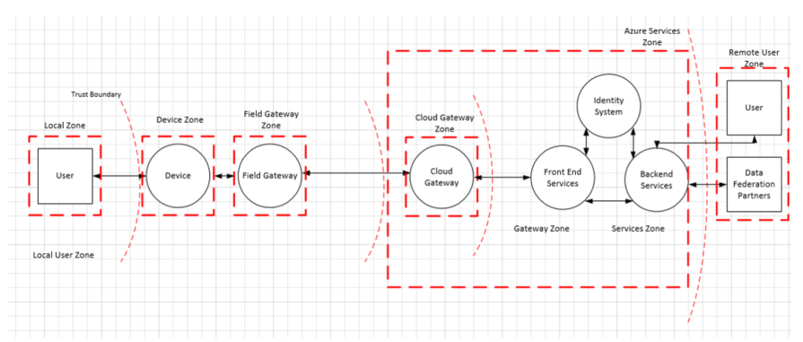

# Arquitetura de segurança Internet das coisas

Ao criar um sistema, é importante entender as possíveis ameaças ao sistema e, em seguida, adicionar defesas apropriadas apropriadamente, como o sistema é projetado e projetado. É especialmente importante projetar o produto a partir do início com segurança em mente, porque a compreensão de como um invasor pode ser capaz de comprometer um sistema de ajuda a tomar atenuações apropriadas claro que estejam em vigor desde o início. 

## Segurança começa com um modelo de ameaça
 
A Microsoft usou longos modelos de ameaça para os seus produtos e tornou publicamente disponível do processo de modelagem de risco da empresa. A experiência de empresa demonstra que o processo de modelagem tem inesperados benefícios além a compreensão imediata dos quais são as ameaças ao máximo referentes ao. Por exemplo, ele também cria uma avenida para uma discussão aberta com outras pessoas fora da equipe de desenvolvimento, que pode resultar em novas ideias e aprimoramentos no produto.
  
O objetivo da modelagem de ameaças é entender como um invasor pode ser capaz de comprometer um sistema e, em seguida, certifique-se de atenuações apropriadas estejam em vigor. Força de modelagem de ameaça o design da equipe a serem considerados atenuações como o sistema foi projetado em vez de após um sistema é implantado. Esse fato é extremamente importante, pois aperfeiçoamento defesas de segurança para uma infinidade de dispositivos no campo é impraticável, sujeito a erros e sairá clientes em risco.

Muitas equipes de desenvolvimento fazem um excelente trabalho captura os requisitos funcionais para o sistema que se beneficiam de clientes. No entanto, identificando formas não óbvio que alguém possa uso indevido do sistema é mais desafiador. Modelagem de ameaças pode ajudar as equipes de desenvolvimento a entender o que um invasor pode fazer e por quê. Modelagem de ameaça é um processo estruturado que cria as decisões de design de uma discussão sobre a segurança no sistema, bem como alterações no design que sejam feitas ao longo do percurso que segurança impacto. Enquanto um modelo de ameaça é simplesmente um documento, esta documentação também representa a maneira ideal para garantir a continuidade de Conhecimento, retenção de lições aprendidas e ajuda a nova equipe integrado rapidamente. Finalmente, o resultado da modelagem de ameaça é para habilitá-lo a considerar outros aspectos de segurança, como os compromissos de segurança que você deseja fornecer aos seus clientes. Esses compromissos em conjunto com a modelagem de ameaças irá informar e teste da sua solução de Internet das coisas (IoT) da unidade.
 

### Quando o modelo de ameaça

[Modelagem de ameaça](http://www.microsoft.com/security/sdl/adopt/threatmodeling.aspx) oferece o maior valor se ela está incorporada à fase de design. Quando você está criando, você tem a maior flexibilidade para fazer alterações para eliminar as ameaças. Eliminação das ameaças por design é o resultado desejado. É muito mais fácil do que adicionando atenuações, testá-las e para garantir que eles permanecem atuais e Além disso, esse eliminação nem sempre é possível. Ele se torna mais difícil eliminar as ameaças como produto se torna mais desenvolvido e, por sua vez, por fim, exigirá mais trabalho e as implicações muito mais difíceis de modelagem desde o início no desenvolvimento de ameaças.

### O que ocorre ao modelo de ameaça

Você deve thread modelo a solução como um todo e também focalizar nas seguintes áreas:

- Os recursos de segurança e privacidade
- Os recursos cujas falhas são relevantes de segurança
- Os recursos que um limite de confiança sensível ao toque 

### Que modelos de ameaça

Modelagem de ameaça é um processo como qualquer outro.  É uma boa ideia trate o documento de modelo de ameaça como qualquer outro componente da solução e validá-lo. Muitas equipes de desenvolvimento fazem um excelente trabalho captura os requisitos funcionais para o sistema que se beneficiam de clientes. No entanto, identificando formas não óbvio que alguém pode uso indevido do sistema é mais desafiador. Modelagem de ameaças pode ajudar as equipes de desenvolvimento a entender o que um invasor pode fazer e por quê.

### Como o modelo de ameaça

A processo de modelagem de ameaças é composta de quatro etapas; as etapas são:

- Modelo do aplicativo
- Enumerar ameaças
- Atenuar ameaças
- Validar as atenuações

#### As etapas do processo

Três regras de bolso ter em mente ao criar um modelo de ameaça:

1. Crie um diagrama de arquitetura de referência. 
2. Inicie o primeiro amplitude. Obtenha uma visão geral e entender o sistema como um todo, antes de começar a profunda.  Isso ajuda a assegurar que você aprofundar nos lugares certos.
3. O processo de unidade, não deixe que o processo de unidade você. Se você encontrar um problema na fase de modelagem e quiser explore-lo, vá para ele!  Não presuma necessário seguir estas etapas submissamente.  

#### Ameaças

Os elementos de quatro principais de um modelo de ameaça são:

- Processos (serviços web, serviços Win32 * nix daemons, etc. Observe que algumas entidades complexas (por exemplo, os gateways de campo e sensores) podem ser extraídas como um processo quando uma técnica de drill down nessas áreas não é possível.
- Dados armazena (em qualquer lugar os dados são armazenados como um arquivo de configuração ou o banco de dados)
- Fluxo de dados (onde dados movimentação entre outros elementos no aplicativo)
- Entidades externas (qualquer coisa que interage com o sistema, mas não está sob o controle do aplicativo, os exemplos incluem usuários e feeds de satélite)

Todos os elementos no diagrama da arquitetura estão sujeitos a várias ameaças; usaremos o mnemônico de distância. Leia [Threat Modeling novamente, STRIDE](https://blogs.msdn.microsoft.com/larryosterman/2007/09/04/threat-modeling-again-stride/) saber mais sobre os elementos de distância.

Diferentes elementos de diagrama de aplicativo estão sujeito determinadas ameaças de distância:

- Processos estão sujeitos a distância
- Fluxos de dados estão sujeitos TID
- Repositórios de dados estão sujeitos TID e, em alguns casos, R, se os repositórios de dados são arquivos de log.
- Entidades externas estão sujeitos SRD

## Segurança no IoT

Dispositivos conectados de propósito especial tem um número significativo de áreas de superfície de interação potenciais e os padrões de interação, todos os quais devem ser considerados para oferecer uma estrutura para proteger o acesso digital para esses dispositivos. O termo "digital access" é usado aqui para distinguir de alguma operação que é executadas por meio da interação direta do dispositivo onde a segurança de acesso é fornecida por meio do controle de acesso físico. Por exemplo, colocar o dispositivo em uma sala com um bloqueio da porta. Enquanto o acesso físico não pode ser negado usando hardware e software, medidas podem ser realizadas para impedir o acesso físico líderes à interferência de sistema. 

Como podemos explorar os padrões de interação, veremos "controle de dispositivo" e "dados de dispositivo" com o mesmo nível de atenção. "Controle de dispositivo" pode ser classificada como quaisquer informações que são fornecidas para um dispositivo por qualquer pessoa com o objetivo de alterar ou que influenciam seu comportamento em direção ao seu estado ou o estado do seu ambiente. "Dados de dispositivo" podem ser classificados como todas as informações que um dispositivo emite a terceiros sobre seu estado e o estado observado do seu ambiente.
   
Para otimizar as práticas recomendadas de segurança, recomenda-se que uma arquitetura IoT típica ser dividido em várias componente/zonas como parte do exercício de modelagem de ameaças. Essas zonas são descritas em detalhes ao longo desta seção e incluem:

-   Dispositivo,
-   Gateway de campo
-   Gateways, em nuvem e
-   Serviços.

As zonas são amplas maneira de segmento de uma solução; cada zona geralmente tem seus próprios requisitos de dados e autenticação e autorização. Zonas também podem ser usado para danos isolamento e restringir o impacto das zonas de confiança baixa nas zonas de confiança mais altas.

Cada zona é separada por um limite de confiança, a linha vermelha pontilhada no diagrama a seguir, conforme mostrado. Ele representa uma transição de dados/informações de uma fonte para outro. Durante essa transição, as informações/dados poderia ser sujeitos a falsificação, violação, repúdio, divulgação de informações, negação de serviço e a elevação do privilégio (distância).

 

Os componentes descritos em cada limite também estão sujeitos a distância, permitindo que um 360 completo da solução do modo de exibição de modelagem de ameaças. As seções a seguir elaborem em cada um dos componentes e preocupações de segurança específicos e soluções que devem ser colocadas no lugar.

As seções a seguir serão abordam os componentes padrão normalmente encontrado nessas zonas.

### A zona de dispositivo

O ambiente de dispositivo é o espaço físico imediato ao redor do dispositivo onde físico acesso e/ou "rede local"-a-ponto acesso digital ao dispositivo é viável. "Rede local" é considerada uma rede que é distintos e estão protegidos de – mas potencialmente uma ponte à – Internet pública e inclui qualquer tecnologia de curto alcance rádio sem fio que permite a comunicação ponto a ponto de dispositivos. Ela faz *não* incluir qualquer tecnologia de virtualização de rede criando a ilusão de tal rede local e também não incluir redes de operador público que exigem qualquer dois dispositivos se comunicarem através de espaço de rede pública que fossem inserir uma relação de comunicação ponto a ponto.

### A zona de Gateway do campo

Gateway de campo é um dispositivo/aparelho ou alguns softwares de computador do servidor de uso geral que atua como ativador de comunicação e, possivelmente, como um sistema de controle de dispositivo e o hub de processamento de dados do dispositivo. A zona do gateway de campo inclui todos os dispositivos que estão conectados a ele e o gateway de campo em si. Como o nome implica, gateways de campo agir instalações de processamento de dados dedicado externo, normalmente são local acoplado, potencialmente estão sujeitos a invasão físico e terá limitados redundância operacional. Tudo para dizer que um gateway de campo é geralmente uma coisa um pode sensível ao toque e sabotar enquanto saber o que é a sua função. 

Um gateway de campo é diferente de um roteador de tráfego meros em que ele exerceu um papel ativo no gerenciamento de acesso e fluxo de informações, que significa que ele é um aplicativo endereçada a conexão de rede e de entidade ou sessão de terminal. Um dispositivo NAT ou firewall, por sua vez, não qualificados como gateways de campo porque elas não são conexão explícita ou terminais de sessão, mas em vez disso, um conexões de rota (ou bloquear) ou sessões feitas por eles. O gateway de campo tem duas áreas de superfície distintas. Um fique voltada para os dispositivos que estão conectados a ele e representa o interior da zona, e o outro faces de todos os parceiros externos e a borda da zona.   

### A zona de gateway de nuvem

Gateway de nuvem é um sistema que permite a comunicação remota from e to dispositivos ou gateways de campo de vários sites diferentes através de espaço de rede pública, geralmente na direção de um controle baseado em nuvem e o sistema de análise de dados, uma federação de tais sistemas. Em alguns casos, um gateway de nuvem pode imediatamente facilitar o acesso a dispositivos de objetivos especiais de terminais como tablets ou telefones. No contexto abordado aqui, "nuvem" destina-se para se referir a um sistema de processamento de dados dedicado que não é vinculado ao mesmo site que os dispositivos conectados ou gateways de campo. Também em uma zona de nuvem, medidas operacionais impedir o acesso físico destino e não é necessariamente expostos a uma infraestrutura de "nuvem pública".  

Um gateway de nuvem potencialmente pode ser mapeado para uma sobreposição de virtualização de rede para isolar o gateway de nuvem e todos os seus dispositivos conectados ou gateways de campo de qualquer outro tráfego de rede. O gateway de nuvem em si é nem um sistema de controle de dispositivo nem um processamento ou instalação de armazenamento de dados do dispositivo; Essas instalações de interface com o gateway de nuvem. Na zona de gateway nuvem inclui o próprio gateway de nuvem, juntamente com todos os gateways de campo e dispositivos direta ou indiretamente anexados a ele. A borda da zona é uma área de superfície distinta onde todos os parceiros externos se comunicar por meio.

### A zona de serviços

"Serviço" é definido para este contexto como qualquer componente de software ou um módulo que é uma interface com dispositivos através de um gateway de campo - ou nuvem para análise e coleta de dados, bem como para o comando e controle.  Os serviços são mediadores. Atuar em sua identidade rumo gateways e outros subsistemas, armazenar e analisar dados, forma autônoma emitir comandos para dispositivos com base em ideias de dados ou agendas e exponham informações e controlam os recursos para os usuários finais autorizados.

### Dispositivos de informação versus dispositivos de objetivos especiais

PCs, telefones e tablets são principalmente dispositivos de informações interativo. Telefones e tablets explicitamente otimizados ao redor maximizando a vida útil da bateria. Eles preferencialmente desativem parcialmente quando não imediatamente interagir com uma pessoa ou quando não fornecendo serviços como tocar música ou direciona seu proprietário para um local específico. De uma perspectiva de sistemas, esses dispositivos de tecnologia da informação principalmente são atuando como proxies na direção de pessoas. Eles são "pessoas acionadores da" sugerindo ações e "sensores de pessoas" coleta de entrada. 

Dispositivos de objetivos especiais de sensores de temperatura simples às linhas de produção de fábrica complexos com milhares de componentes internos-los, são diferentes. Esses dispositivos são muito mais escopo em objetivo e mesmo se eles oferecem alguma interface de usuário, eles são amplamente com escopo para a interface com ou será integrados aos ativos no mundo físico. Eles medem e relatar circunstâncias ambientais, ativar Válvulas, controlam servos, alarmes de som, Alternar luzes e fazer muitas outras tarefas. Elas ajudam para realizar um trabalho para o qual um dispositivo informações é muito genérico, muito caro, muito grande ou muito frágil. O propósito concreto dita imediatamente seu design técnico como bem o orçamento monetário disponível para seus produção e a operação de tempo de vida agendada. A combinação desses dois fatores principais restringe as disponível compute de orçamento de energia, espaço físico e, portanto, armazenamento disponível, operacional e os recursos de segurança.  

Se algo "vai errado" com dispositivos pode ser controlados automatizados ou remotos, por exemplo, defeitos físicos ou lógica de controle de defeitos de manipulação e willful invasão não autorizada. Muito a produção pode ser destruído, prédios podem estar sacados ou gravados para baixo e pessoas podem ser ferido ou até mesmo chip. Isto é, obviamente, uma classe toda diferente de danos do que alguém maximizar o limite do cartão de crédito roubado. A barra de segurança para dispositivos que tornar as coisas mover e também para os dados do sensor eventualmente resulta em comandos que causam coisas que você deve mover, deve ser maior do que em qualquer comércio ou cenário bancário. 

### Controle de dispositivo e interações de dados do dispositivo

Dispositivos conectados de propósito especial tem um número significativo de áreas de superfície de interação potenciais e os padrões de interação, todos os quais devem ser considerados para oferecer uma estrutura para proteger o acesso digital para esses dispositivos. O termo "digital access" é usado aqui para distinguir de alguma operação que é executadas por meio da interação direta do dispositivo onde a segurança de acesso é fornecida por meio do controle de acesso físico. Por exemplo, colocar o dispositivo em uma sala com um bloqueio da porta. Enquanto o acesso físico não pode ser negado usando hardware e software, medidas podem ser realizadas para impedir o acesso físico líderes à interferência de sistema. 
 
Como podemos explorar os padrões de interação, veremos "controle de dispositivo" e "dados de dispositivo" com o mesmo nível de atenção durante a modelagem de ameaças. "Controle de dispositivo" pode ser classificada como quaisquer informações que são fornecidas para um dispositivo por qualquer pessoa com o objetivo de alterar ou que influenciam seu comportamento em direção ao seu estado ou o estado do seu ambiente. "Dados de dispositivo" podem ser classificados como todas as informações que um dispositivo emite a terceiros sobre seu estado e o estado observado do seu ambiente. 

## A arquitetura de referência do Windows Azure IoT de modelagem de risco

A Microsoft usa o framework descrito acima para modelagem para Azure IoT de ameaça. Na seção abaixo, portanto, usamos o exemplo concreto da arquitetura de referência do Windows Azure IoT para demonstrar como pensar ameaça para IoT de modelagem e para lidar com as ameaças identificadas. No nosso caso, podemos identificados quatro principais áreas de foco:

-   Fontes de dados e dispositivos
-   Transporte de dados
-   Dispositivo e processamento de eventos e
-   Apresentação

 

O diagrama a seguir fornece uma visão simplificada da arquitetura de IoT da Microsoft usando um modelo de diagrama de fluxo de dados que é usado pela ferramenta de modelagem de ameaça do Microsoft:

É importante observar que a arquitetura separa as capacidades de dispositivo e o gateway. Isso permite ao usuário aproveitar os dispositivos de gateway que são mais seguros: são capazes de se comunicar com o gateway de nuvem usando protocolos seguros, que geralmente requer maior sobrecarga de processamento que um dispositivo nativo - como um termostato - poderia fornecer por conta própria. Na zona de serviços do Azure, assumimos que o Gateway de nuvem é representado pelo serviço do Windows Azure IoT Hub.

### Transporte de fontes/dados do dispositivo e dados

Esta seção explora a arquitetura descrita acima por meio da Lente de modelagem de ameaças e fornece uma visão geral de como podemos estão lidando com algumas das preocupações inerentes. Ênfase será colocada nos elementos principais de um modelo de ameaça:

- Processos (aqueles em nosso controle e itens externos)
- Comunicação (também chamada de fluxos de dados)
- Armazenamento (também chamado de repositórios de dados)

#### Processos

Em cada uma das categorias descritas na arquitetura do Windows Azure IoT, tentaremos atenuar um número de diferentes ameaças entre os diferentes estágios/informações de dados existe no: processo, comunicação e armazenamento. Veja abaixo oferecemos uma visão geral das mais comuns para a categoria "processo de", seguido de uma visão geral de como essas poderiam ser melhor minimizadas: 

**Falsificação (S)**: um invasor pode extrair o material da chave criptográfico de um dispositivo no nível do software ou hardware, e subsequentemente access o sistema com outro dispositivo físico ou virtual sob a identidade do dispositivo o material da chave foi obtido. Uma boa ilustração é controles remotos que pode transformar qualquer TV e que sejam ferramentas prankster populares.

**Negação de serviço (D)**: um dispositivo pode ser renderizado incapaz de funcionamento ou comunicação por interferir frequências de rádio ou cabos de corte. Por exemplo, uma câmera vigilância que tiveram seu conexão de rede ou power intencionalmente suprimido não reportará dados, nisso.

**Violação (T)**: um invasor poderá parcialmente ou parcialmente substituir o software em execução no dispositivo, potencialmente permitindo que o software substituído aproveitar a identidade genuína do dispositivo, se o material da chave ou as instalações criptográficas mantendo os principais materiais estavam disponíveis para o programa ilícito. Por exemplo, o invasor pode aproveitar extraído material da chave para interceptar e suprimir dados do dispositivo no caminho de comunicação e substituí-la com dados falsos que são autenticados com o material da chave roubado.

**Divulgação de informações (I)**: se o dispositivo estiver executando software manipulado, tal software manipulado potencialmente poderia vazem dados a terceiros não autorizados. Por exemplo, um invasor pode aproveitar extraído material da chave para introduzir próprio no caminho de comunicação entre o dispositivo e um campo ou controlador gateway ou nuvem para extraia desativa informações.

**Elevação de privilégio (F)**: um dispositivo que executa a função específica pode ser forçado a fazer algo diferente. Por exemplo, uma válvula programada para abrir a metade do caminho pode ser levada para abrir completamente.

| **Componente** | **Ameaça** | **Redução de risco**                                                                                                                                                | **Risco**                                                                                                                                                                                                    | **Implementação**                                                                                                                                                                                                                                                                                                                                     |
|---------------|------------|---------------------------------------------------------------------------------------------------------------------------------------------------------------|-------------------------------------------------------------------------------------------------------------------------------------------------------------------------------------------------------------|--------------------------------------------------------------------------------------------------------------------------------------------------------------------------------------------------------------------------------------------------------------------------------------------------------------------------------------------------------|
| Dispositivo        | S          | Atribuindo a identidade ao dispositivo e autenticar o dispositivo                                                                                                | Substituindo dispositivo ou parte do dispositivo por algum outro dispositivo. Como nós sabemos que estamos falando para o dispositivo certo?                                                                                           | Autenticando o dispositivo, usando a segurança de camada de transporte (TLS) ou IPSec. Infraestrutura deve oferecer suporte usando a chave pré-compartilhada (PSK) nesses dispositivos que não dá suporte a criptografia assimétrica completa. Aproveite o Azure AD, [OAuth](http://www.rfc-editor.org/in-notes/internet-drafts/draft-ietf-ace-oauth-authz-01.txt)                             |
|               | TRID       | Aplica mecanismos de protegido contra violação ao dispositivo por exemplo, tornando muito difícil para impossível extrair chaves e outros materiais criptográficos do dispositivo. | O risco é se alguém é violação do dispositivo (interferência físico). Como estamos com certeza, esse dispositivo não violado.                                                                                 | A atenuação mais eficiente é uma funcionalidade de módulo (TPM) de plataforma confiável que permite o armazenamento de chaves no circuito especial de em chip do qual as chaves não podem ser lidas, mas só podem ser usadas para operações de criptografia que usam a chave, mas nunca divulguem a chave. Criptografia de memória do dispositivo. Gerenciamento de chaves do dispositivo. O código de assinatura. |
|               | F          | Tendo o controle de acesso do dispositivo. Esquema de autorização.                                                                                                    | Se o dispositivo permitir ações individuais a serem executadas com base em comandos de uma fonte externa ou até mesmo comprometidos sensores, ele permitirá que o ataque executar operações não contrário acessível. | Tendo o esquema de autorização para o dispositivo                                                                                                                                                                                                                                                                                                             |
| Gateway de campo | S          | Autenticando o gateway de campo para nuvem Gateway (cert com base, PSK, declaração com base, …)                                                                           | Se alguém pode falsificar o campo Gateway, ele pode representar próprio como qualquer dispositivo.                                                                                                                               | RSA/PSK, IPSe, de TLS [RFC 4279](https://tools.ietf.org/html/rfc4279). Todos os mesmos principais preocupações de armazenamento e a certificação de dispositivos em geral – melhor caso é usar TPM. Extensão 6LowPAN para IPSec oferecer suporte a redes de Sensor sem fio (WSN).                                                                                                              |
|               | TRID       | Proteger o Gateway de campo contra violação (TPM)?                                                                                                            | Que fazer com que o raciocínio de gateway de nuvem que está se comunicando ao gateway do campo ataques de falsificação pode resultar em divulgação de informações e violação de dados                                                             | Do memória criptografia, TPM, autenticação.                                                                                                                                                                                                                                                                                                              |
|               | F          | Mecanismo de controle de acesso para o Gateway de campo                                                                                                                    |                                                                                                                                                                                                             |                                                                                                                                                                                                                                                                                                                                                        |

Aqui estão alguns exemplos de ameaças nesta categoria:

Falsificação: Um invasor pode extrair material da chave criptográfico de um dispositivo, tanto no software ou hardware nível e, subsequentemente o sistema com outro dispositivo físico ou virtual sob a identidade do dispositivo o material da chave tenha sido efetuado a partir do access.

**Negação de serviço**: um dispositivo pode ser renderizado incapaz de funcionamento ou comunicação por interferir frequências de rádio ou cabos de corte. Por exemplo, uma câmera vigilância que tiveram seu conexão de rede ou power intencionalmente suprimido não reportará dados, nisso.

**Violação**: um invasor poderá parcialmente ou parcialmente substituir o software em execução no dispositivo, potencialmente permitindo que o software substituído aproveitar genuína identidade do dispositivo, se o material da chave ou as instalações criptográficas mantendo os principais materiais estavam disponíveis para o programa ilícito.

**Violação**: uma câmera vigilância que está mostrando uma imagem espectro visível de um corredor vazia poderia ser voltada para uma fotografia de tal um corredor. Um sensor fumaça ou incêndio poderia ser relatórios alguém mantendo um mais claro sob ele. Em ambos os casos, o dispositivo pode ser tecnicamente totalmente confiável na direção do sistema, mas ele reporta informações manipuladas.

**Violação**: um invasor pode aproveitar o material da chave extraído para interceptar e suprimir dados do dispositivo no caminho de comunicação e substituí-la com dados falsos são autenticados com o material da chave roubado.

**Violação**: um invasor poderá completamente ou parcialmente substituir o software em execução no dispositivo, potencialmente permitindo que o software substituído aproveitar a identidade genuína do dispositivo se o material da chave ou as instalações criptográficas mantendo os principais materiais estavam disponíveis para o programa ilícito.
   
**Divulgação de informações**: se o dispositivo estiver executando software manipulado, tal software manipulado potencialmente poderia vazem dados autorizadas.

**Divulgação de informações**: o invasor pode aproveitar extraído material da chave para introduzir próprio no caminho de comunicação entre o gateway de dispositivo e um campo ou controlador ou nuvem para extraia as informações.

**Negação de serviço**: O dispositivo pode ser desativado ou transformado em um modo em que a comunicação não é possível (que é intencional em várias máquinas industriais).

**Violação**: O dispositivo pode ser reconfigurado para operar em um estado desconhecido para o sistema de controle (fora parâmetros calibragem conhecidos) e, portanto, fornecer dados que podem ser interpretados

**Elevação de privilégio**: um dispositivo que executa a função específica pode ser forçado a fazer algo diferente. Por exemplo, uma válvula programada para abrir a metade do caminho pode ser levada para abrir completamente.

**Negação de serviço**: O dispositivo pode ser convertido em um estado onde a comunicação não é possível.

**Violação**: O dispositivo pode ser reconfigurado para operar em um estado desconhecido para o sistema de controle (fora parâmetros calibragem conhecidos) e, portanto, fornecer dados que podem ser interpretados.
 
**Falsificação/violação/repúdio**: caso não protegido (que raramente é o caso com controles do consumidor remotos) um invasor pode manipular o estado de um dispositivo de forma anônima. Uma boa ilustração é controles remotos que pode transformar qualquer TV e que sejam ferramentas prankster populares.

#### Comunicação

Ameaças ao redor do caminho de comunicação entre dispositivos, dispositivos e gateways de campo e gateway de dispositivo e a nuvem. A tabela a seguir tem algumas diretrizes ao redor de soquetes abertos no dispositivo/VPN:

| **Componente**               | **Ameaça** | **Redução de risco**                                      | **Risco**                                                                                                      | **Implementação**                                                                                                                                                                                                                                                                                                                                                               |
|-----------------------------|------------|-----------------------------------------------------|---------------------------------------------------------------------------------------------------------------|----------------------------------------------------------------------------------------------------------------------------------------------------------------------------------------------------------------------------------------------------------------------------------------------------------------------------------------------------------------------------------|
| Hub de IoT do dispositivo              | TID        | (D) TLS (PSK/RSA) para criptografar o tráfego             | A interceptação ou interfiram a comunicação entre o dispositivo e o gateway                             | Segurança no nível do protocolo. Com os protocolos personalizados, precisamos descobrir como protegê-los. Na maioria dos casos, a comunicação ocorre do dispositivo para o Hub IoT (o dispositivo inicia a conexão).                                                                                                                                                                 |
| Dispositivo de dispositivo               | TID        | (D) TLS (PSK/RSA) para criptografar o tráfego.            | Lendo dados em trânsito entre dispositivos. Violação de dados. Sobrecarga ao dispositivo com novas conexões | Segurança no nível do protocolo (MQTT/AMQP/HTTP/CoAP. Com os protocolos personalizados, precisamos descobrir como protegê-los. A redução de risco DoS é par de dispositivos por meio de um gateway de nuvem ou campo e fazê-las apenas agir como clientes na direção da rede. A correspondência pode resultar em uma conexão direta entre os pontos após ter sido orientado pelo gateway |
| Dispositivo de entidade externa      | TID        | Emparelhamento forte da entidade externa ao dispositivo | A interceptação a conexão ao dispositivo. Interferência a comunicação com o dispositivo                     | A entidade externa para o dispositivo LE NFC/Bluetooth de emparelhamento com segurança. Controlando o painel operacional do dispositivo (físico)                                                                                                                                                                                                                                                  |
| Gateway de nuvem de Gateway do campo | TID        | TLS (PSK/RSA) para criptografar o tráfego.               | A interceptação ou interfiram a comunicação entre o dispositivo e o gateway                             | Segurança no nível do protocolo (MQTT/AMQP/HTTP/CoAP). Com os protocolos personalizados, precisamos descobrir como protegê-los.                                                                                                                                                                                                                                                       |
| Gateway de nuvem de dispositivo        | TID        | TLS (PSK/RSA) para criptografar o tráfego.               | Interceptação ou interfiram a comunicação entre o dispositivo e o gateway                             | Segurança no nível do protocolo (MQTT/AMQP/HTTP/CoAP). Com os protocolos personalizados, precisamos descobrir como protegê-los.                                                                                                                                                                                                                                                       |

Aqui estão alguns exemplos de ameaças nesta categoria:

**Negação de serviço**: dispositivos restritos são geralmente sob ameaça DoS quando eles ouvem ativamente para conexões de entrada ou não solicitadas datagramas em uma rede, porque um invasor pode abrir conexões muitos em paralelo e não os servem ou servem-los muito lentamente ou o dispositivo pode ser incluídas inserido com tráfego não solicitado. Em ambos os casos, o dispositivo efetivamente pode ficar inoperante na rede.

**Falsificação, divulgação de informações**: dispositivos restritos e dispositivos de objetivos especiais geralmente têm instalações de segurança de um-para-all como senha ou a proteção de PIN ou totalmente contam com confiando na rede, que significa que eles concederão acesso às informações quando um dispositivo está na mesma rede e que a rede geral somente é protegida por uma chave compartilhada. Isso significa que, quando o segredo compartilhado para o dispositivo ou rede está divulgado é possível controlar o dispositivo ou observar dados emitidos do dispositivo.  

**Falsificação**: um invasor pode interceptar ou parcialmente substituir a difusão e falsificar o originador (ataque no meio)

**Violação**: um invasor pode interceptar ou parcialmente substituir a difusão e enviar informações falsos 

**Information Disclosure:** um invasor pode interceptar a uma transmissão e obtenham informações sem autorização **negação de serviço:** um invasor pode negar a distribuição de informações e jam sinal de transmissão

#### Armazenamento

Cada gateway de dispositivo e campo tem alguma forma de armazenamento (temporário para os dados, o armazenamento de imagem de sistema operacional de enfileiramento de mensagens).

| **Componente**                            | **Ameaça** | **Redução de risco**                       | **Risco**                                                                                                                                                                                                                                                                                                                | **Implementação**                                                                                                                                                     |
|------------------------------------------|------------|--------------------------------------|-------------------------------------------------------------------------------------------------------------------------------------------------------------------------------------------------------------------------------------------------------------------------------------------------------------------------|------------------------------------------------------------------------------------------------------------------------------------------------------------------------|
| Armazenamento de dispositivo                           | TRID       | Criptografia de armazenamento, os logs de assinatura | Leitura de dados do armazenamento (dados PII), interferência nos dados de telemetria. Violação com permanece na fila ou o cache de dados de controle do comando. Violação com pacotes de atualização de firmware ou configuração enquanto cache ou enfileiradas localmente pode levar a comprometidas de componentes de sistema operacional e/ou o sistema                                         | Criptografia, código de autenticação de mensagem (MAC) ou assinatura digital. Onde o controle de acesso forte possíveis por meio de acesso a recursos controlar permissões ou listas (ACLs). |
| Imagem do sistema operacional do dispositivo                          | TRID       |                                      | Violação com SO / substituindo os componentes do sistema operacional                                                                                                                                                                                                                                                                         | Partição do sistema operacional somente leitura, conectado a imagem do sistema operacional, criptografia                                                                                                                    |
| Armazenamento de campo Gateway (os dados do enfileiramento de mensagens) | TRID       | Criptografia de armazenamento, os logs de assinatura | Leitura de dados do armazenamento (dados PII), interferência nos dados de telemetria, violação com enfileiradas ou cache de dados de controle do comando. Violação com pacotes de atualização de firmware ou configuração (destinados para dispositivos ou gateway de campo) enquanto cache ou enfileiradas localmente pode levar a comprometidas de componentes de sistema operacional e/ou o sistema | BitLocker                                                                                                                                                              |
| Imagem do sistema operacional de Gateway do campo                   | TRID       |                                      | Violação com SO / substituindo os componentes do sistema operacional                                                                                                                                                                                                                                                                          | Partição do sistema operacional somente leitura, conectado a imagem do sistema operacional, criptografia                                                                                                                    |

### Zona de gateway de nuvem de processamento/dispositivo e eventos

Um gateway de nuvem é um sistema que permite a comunicação remota de e para dispositivos ou gateways de campo de vários sites diferentes através de espaço de rede pública, geralmente na direção de um controle baseado em nuvem e o sistema de análise de dados, uma federação de tais sistemas. Em alguns casos, um gateway de nuvem pode imediatamente facilitar o acesso a dispositivos de objetivos especiais de terminais como tablets ou telefones. No contexto abordado aqui, quer dizer "nuvem" se referir a um sistema de processamento de dados dedicado que não é vinculado ao mesmo site que os dispositivos conectados ou gateways de campo e onde medidas operacionais impedir voltadas acesso físico, mas não é necessariamente para uma infra-estrutura de "nuvem pública".  Um gateway de nuvem potencialmente pode ser mapeado para uma sobreposição de virtualização de rede para isolar o gateway de nuvem e todos os seus dispositivos conectados ou gateways de campo de qualquer outro tráfego de rede. O gateway de nuvem em si é nem um sistema de controle de dispositivo nem um processamento ou instalação de armazenamento de dados do dispositivo; Essas instalações de interface com o gateway de nuvem. A zona de gateway de nuvem inclui o gateway de nuvem em si, juntamente com todos os gateways de campo e dispositivos direta ou indiretamente anexados a ele.

Gateway de nuvem é principalmente personalizados criados software executando como um serviço com pontos de extremidade expostos ao qual conectam dispositivos e o gateway de campo. Como tal, devem ser projetado com segurança em mente. Siga o processo [SDL](http://www.microsoft.com/sdl) para projetar e construir esse serviço. 

#### Zona de serviços

Um sistema de controle (ou controlador) é uma solução de software que interage com um dispositivo, ou um gateway de campo ou gateway de nuvem para fins de controle de um ou vários dispositivos e/ou para coletar e/ou armazenar e/ou analisar os dados do dispositivo para fins de controle subsequentes, ou apresentação. Sistemas de controle são as entidades apenas no escopo desta discussão que podem facilitar a interação com pessoas imediatamente. A exceção são intermediária mostra física do controle em dispositivos, como uma opção que permite que uma pessoa para desativar o dispositivo ou alterar outras propriedades e para o qual há nenhum equivalente funcional que possa ser acessado digitalmente. 

Intermediária mostra física do controle são aquelas onde qualquer tipo de governança lógica restringe a função da superfície de controle físico, de tal modo que uma função equivalente possa ser iniciada remotamente ou entrada está em conflito com entrada remota pode ser evitados – tais intermediated mostra do controle são conceitualmente anexado a um sistema de controle de local que aproveita a mesma funcionalidade subjacente que qualquer outro sistema de controle remoto que o dispositivo pode estar anexado em paralelo. Principais ameaças para a nuvem computação podem ser lidas na página [Segurança de nuvem Alliance (CSA)](https://cloudsecurityalliance.org/research/top-threats/) .

## Recursos adicionais

Consulte os artigos a seguir para obter informações adicionais:

- [Ferramenta de modelagem de ameaça SDL](https://www.microsoft.com/sdl/adopt/threatmodeling.aspx)
- [Arquitetura de referência do Microsoft Azure IoT](https://azure.microsoft.com/updates/microsoft-azure-iot-reference-architecture-available/)
 
