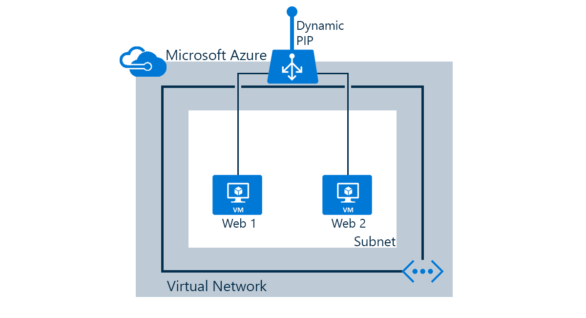

As seguintes tarefas serão feitas neste cenário:

* Criar um balanceador de carga que recebe o tráfego de rede na porta 80 e enviar o tráfego com balanceamento de carga para máquinas virtuais "web1" e "web2"
* Criar regras NAT para o remote desktop acesso/SSH para máquinas virtuais atrás do balanceador de carga
* Criar testes de integridade

