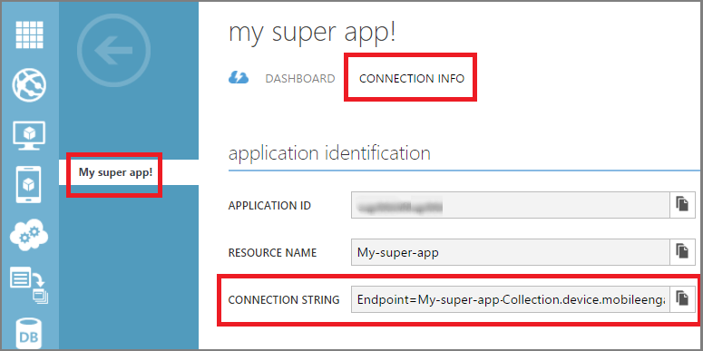

1. Faça logon no [Portal de clássico do Azure](https://manage.windowsazure.com)e, em seguida, clique em **+ nova** na parte inferior da tela.

2. Clique em **Serviços de aplicativo**, e em seguida, **compromisso móvel**e, em seguida, **criar**.

    

3. No pop-up que aparece, insira as seguintes informações:

    

    - **Nome do aplicativo**: nome do seu aplicativo. 
    - **Plataforma**: plataforma de destino para o aplicativo. Você deve criar um aplicativo móvel contrato por plataforma que você está destinando para o aplicativo mobile. 
    - **Nome de recurso do aplicativo**: nome pelo qual este aplicativo poderá ser acessado por meio de APIs e URLs. 
    - **Local**: região/Data center onde este aplicativo e o conjunto de aplicativos serão hospedados.
    - **Conjunto**: selecione um conjunto criado anteriormente ou selecione 'Novo conjunto'.
    - **Nome da coleção**: representa o seu grupo de aplicativos. Isso também garantirá que todos os seus aplicativos estão em um grupo que permitirá agregados cálculos de métricas. Você deve usar seu nome de empresa ou departamento aqui se aplicável.

4. Selecione o aplicativo que você acabou de criar na guia **aplicativos** .

5. Clique em **Informações de conexão** para exibir as configurações de conexão para colocar em sua integração SDK no seu aplicativo móvel.

6. Copie a **Cadeia de conexão** - esse é o que você precisará identificar este aplicativo em seu código de aplicativo e conecte-se com o contrato de celular de seu aplicativo.

    

