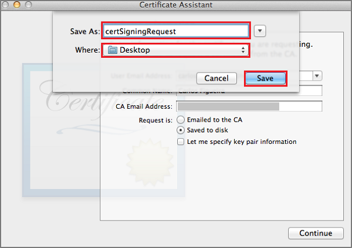

Para registrar o aplicativo para notificações de envio por meio de serviço de notificação de Push para Apple (APNS), você deve criar um novo certificado de envio, a ID de aplicativo e perfil de provisionamento do projeto no portal do desenvolvedor da Apple. A ID de aplicativo conterá as definições de configuração que habilitam o seu aplicativo enviar e receber notificações por push. Essas configurações incluirá o certificado de notificação de envio necessário para autenticar com o Apple Push notificação de serviço (APNS) ao enviar e receber notificações por push. Para obter mais informações sobre esses conceitos, consulte a documentação oficial do [Serviço de notificações Push da Apple](http://go.microsoft.com/fwlink/p/?LinkId=272584) .

####Gerar o arquivo de solicitação de assinatura de certificado do certificado de envio

Estas etapas o orientará na criação de solicitação de assinatura do certificado. Isso será usado para gerar um certificado de envio a serem usados com APNS.

1. No seu Mac, execute a ferramenta de acesso às chaves. Ele pode ser aberto de pasta **utilitários** ou a **outra** pasta no teclado de lançamento.

2. Clique em **Acesso às chaves**, expanda **Assistente de certificado**, clique em **solicitar um certificado de uma autoridade de certificação...**.

    

3. Selecione seu **Endereço de Email do usuário** e o **Nome comum** , certifique-se de que **salvou no disco** está selecionada e clique em **continuar**. Deixe o campo de **Endereço de Email de CA** em branco que não seja necessária.

    

4. Digite um nome para o arquivo de solicitação de assinatura de certificado (CSR) em **Salvar como**, selecione o local no **local**e clique em **Salvar**.

    

    Isso salva o arquivo CSR no local selecionado; o local padrão é na área de trabalho. Lembre-se o local escolhido para este arquivo.

####Registrar seu aplicativo para notificações por push

Criar uma nova ID de aplicativo explícita para seu aplicativo com o Apple e também configurá-lo para notificações por push.  

1. Navegue até o [Portal de provisionamento do iOS](http://go.microsoft.com/fwlink/p/?LinkId=272456) no Apple Developer Center, faça logon com sua ID de Apple, clique **identificadores**, clique **IDs de aplicativo**e finalmente, clique no **+** entrar registrar um novo aplicativo.

    

2. Atualize os seguintes três campos para seu novo aplicativo e clique em **continuar**:

    * **Nome**: digite um nome descritivo para o aplicativo no campo **nome** da seção de **Descrição do ID de aplicativo** .

    * **Identificador de pacote**: sob a seção de **ID de aplicativo explícita** , insira um **Identificador de pacote** no formulário `<Organization Identifier>.<Product Name>` conforme mencionado no [Guia de distribuição de aplicativo](https://developer.apple.com/library/mac/documentation/IDEs/Conceptual/AppDistributionGuide/ConfiguringYourApp/ConfiguringYourApp.html#//apple_ref/doc/uid/TP40012582-CH28-SW8). Isso deve corresponder à que também é usado no projeto XCode, Xamarin ou Cordova para o aplicativo.

    * **Notificações push**: marque a opção de **Notificações Push** na seção de **Serviços de aplicativo** ,.

    

3.  Na sua tela de ID de aplicativo confirme, examine a configuração e depois de ter verificado-los clique em **Enviar**

4.  Depois que você enviou a nova ID de aplicativo, você verá a tela de **Registro concluído** . Clique em **concluído**.

5. No centro do desenvolvedor, em identificações de aplicativo, localize a ID de aplicativo que você acabou de criar e clique em sua linha. Clique na linha de ID do aplicativo exibir os detalhes do aplicativo. Clique no botão **Editar** na parte inferior.

6. Role até a parte inferior da tela e clique no botão **Criar certificado …** sob a seção **Certificado SSL Push de desenvolvimento**.

    

    Isso exibirá o Assistente "Adicionar iOS certificado".

    > [AZURE.NOTE] Este tutorial usa um certificado de desenvolvimento. O mesmo processo é usado ao registrar um certificado de produção. Apenas certifique-se de que você use o mesmo tipo de certificado ao enviar notificações.

7. Clique em **Escolher arquivo**, navegue até o local onde você salvou o CSR para seu certificado de envio. Em seguida, clique em **Gerar**.

    

8. Depois que o certificado é criado pelo portal, clique no botão **Baixar** .

    

    Isso baixa o certificado de assinatura e salva em seu computador na pasta Downloads.

    

    > [AZURE.NOTE] Por padrão, o arquivo baixado um certificado de desenvolvimento é chamado **aps_development.cer**.

9. Clique duas vezes o certificado de envio baixado **aps_development.cer**. Isso instala o novo certificado no repositório de chaves, conforme mostrado abaixo:

    

    > [AZURE.NOTE] O nome do seu certificado pode ser diferente, mas ele será prefixado com **desenvolvimento de Apple iOS Push serviços:**.

10. Em acesso às chaves, clique com botão direito o novo certificado de envio que você acabou de criar na categoria de **certificados** . Clique em **Exportar**, nomeie o arquivo, selecione o formato **. p12** e clique em **Salvar**.

    Lembre-se o nome do arquivo e o local do certificado push P12 exportado. Ele será usado para habilitar a autenticação com APNS carregar no Portal de clássico do Azure.

####Criar um perfil de provisionamento do aplicativo

1. Voltar no <a href="http://go.microsoft.com/fwlink/p/?LinkId=272456" target="_blank">Portal de provisionamento do iOS</a>, selecione **Perfis de provisionamento**, selecionar **tudo**e, em seguida, clique na **+** botão para criar um novo perfil. Isso inicia o assistente **Adicionar iOS Provisiong perfil**

    

2. Selecione **iOS desenvolvimento de aplicativos** em **desenvolvimento** como o tipo de perfil provisiong e clique em **continuar**.

3. Em seguida, selecione a ID de aplicativo que você acabou de criar na lista suspensa de **ID de aplicativo** e clique em **continuar**

    

4. Na tela **Selecione certificados** , selecione o certificado de desenvolvimento usado para assinatura de código e clique em **continuar**. Este é um certificado de assinatura, não o certificado de envio que você acabou de criar.

    

5. Em seguida, selecione os **dispositivos** para uso em testes e clique em **continuar**

    

6. Por fim, selecione um nome para o perfil em **Nome do perfil**, clique em **Gerar**.

    
