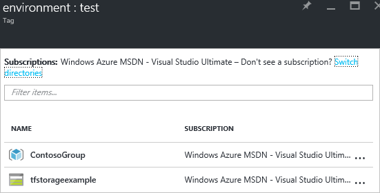

1. Para adicionar marcas a recursos existentes e grupos de recursos, selecione o ícone de marca. 

     

1. Consulte uma lista de marcas que sua organização já aplicada aos recursos. Se você não tiver aplicado anteriormente marcas, a lista está vazia. Para adicionar uma marca, especifique um nome e um valor e pressione Enter. Depois de adicionar marcas a algumas, você observará opções de preenchimento automático com base em nomes de marca e valores existentes previamente. Essas opções de preenchimento automático garantir uma taxonomia consistente em seus recursos e evitar erros comuns, como erros de ortografia.

     

1. Para exibir sua taxonomia de marcas no portal, selecione **Mais serviços** e **marcas**.

     

1. Você pode ver um resumo das marcas em sua assinatura.

     

1. Selecione qualquer uma das marcas para exibir os recursos e grupos de recursos com essa marca.

     

1. Fixe as marcas mais importantes para o painel de controle para acesso rápido.

     
